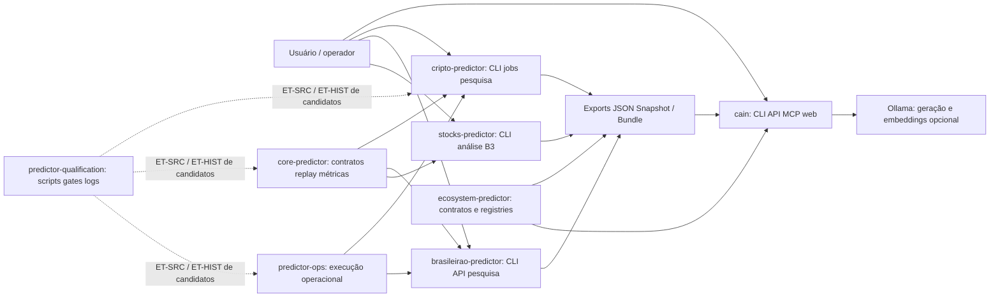
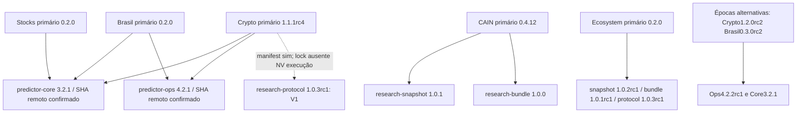
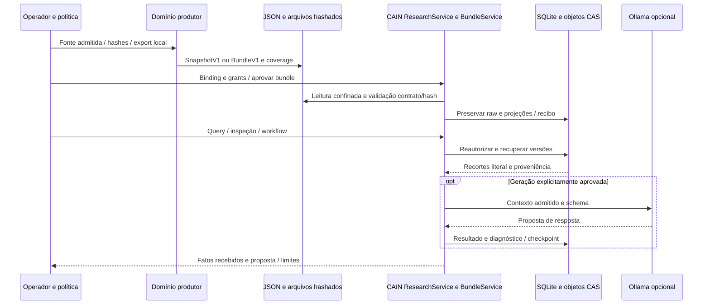

# Arquitetura geral reconstruída

Esta arquitetura descreve as fontes primárias congeladas em LINHA_DE_BASE.md. Todos os oito HEADs locais diferem de main remoto consultado; raízes alternativas possuem suplementos próprios. Um pacote declarado, uma wheel publicada, uma instalação e um serviço ativo são identidades distintas. Não generalizar estes diagramas para a stack V2 do Anexo A.

## Contexto

As arestas sólidas representam imports, chamadas ou exportadores observados em código; execução conjunta atual continua NV. O qualificador reúne instrumentos e registros de candidatos específicos, sem atuar como serviço central em produção. CAIN recebe material de pesquisa por contratos e permissões locais; a fonte primária examinada não demonstra o orquestrador de domínios V2 descrito no Anexo. Arestas tracejadas do qualificador são ET-SRC/ET-HIST, não uso atual observado. Core oferece regras científicas; Ops controla processo e proveniência, não mérito científico ou autorização econômica.

Fontes: manifests e imports em evidencias/package-chain.json; integrações nos oito inventories; contratos do Ecosystem; src/cain/research/{service,bundles}.py; exportadores de cada domínio. Testes são identificados nas matrizes e inventários.

## Dependências e versões

A seta indica dependência do consumidor. CAIN declara versões de Snapshot/Bundle anteriores às versões dos subpacotes presentes no Ecosystem primário. Crypto declara protocolo1.0.3rc1 sem entrada correspondente no lock examinado. Stocks primário declara Core, sem presumir Ops de outras épocas. URLs/hashes integrais estão em package-chain.json e package-chain-asset-check.json. Pins diferentes de terceiros são catalogados; a impossibilidade de resolver todos juntos permanece NV, sem execução de resolver/compat.

As wheels verificadas não têm README idêntico ao checkout primário sob o mesmo número de versão. Isso confirma diferença de conteúdo documental, não identidade do restante do código instalado. O pacote protocol local não declara README no manifest examinado; portanto a afirmação do Anexo sobre todos embutirem README não se aplica automaticamente a esse manifest.

## Fluxo documental completo

O fluxo reúne caminhos implementados de exportação e ingestão documental. Uma exportação real pode conter apenas relatórios históricos, não dados ou experimentos completos. CAIN preserva os bytes recebidos, versões e coverage; query registra auditoria e não deve ser executada no original para inspeção forense. Bundles requerem aprovação e persistem objetos antes das projeções SQL; falhas tardias podem deixar órfãos. Geração validada estruturalmente continua proposta, sem certificação factual. Nenhuma aresta representa capital autorizado ou edge demonstrado.

## Fluxo executável de pesquisa observado

Crypto primário possui research_admission → research_execution → research_worker → research_results, com ResearchTaskV1 autenticada, CAS de entrada, Ops, trial/journal e ResearchResultV1 assinada. Isso é um caminho distinto do Snapshot/Bundle documental. Admissão, execução concluída, resultado científico e estado econômico não devem ser confundidos. As raízes alternativas Crypto/Brasil introduzem pedidos próprios LOCAL_FILE_ONLY sobre Core/Ops; não são evidência de consumidor V2 CAIN no checkout primário.

Detalhes e falhas: COMO_FUNCIONA de cada projeto, MATRIZ_INTEGRACOES e suplementos. Instalações, spool V2 atual, modelos ativos, bancos privados e resultados prospectivos permanecem NV nesta investigação.
