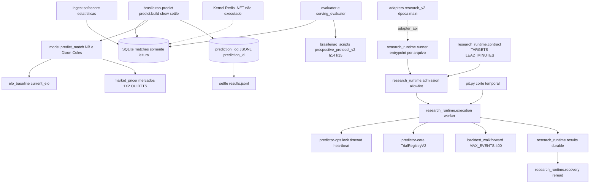
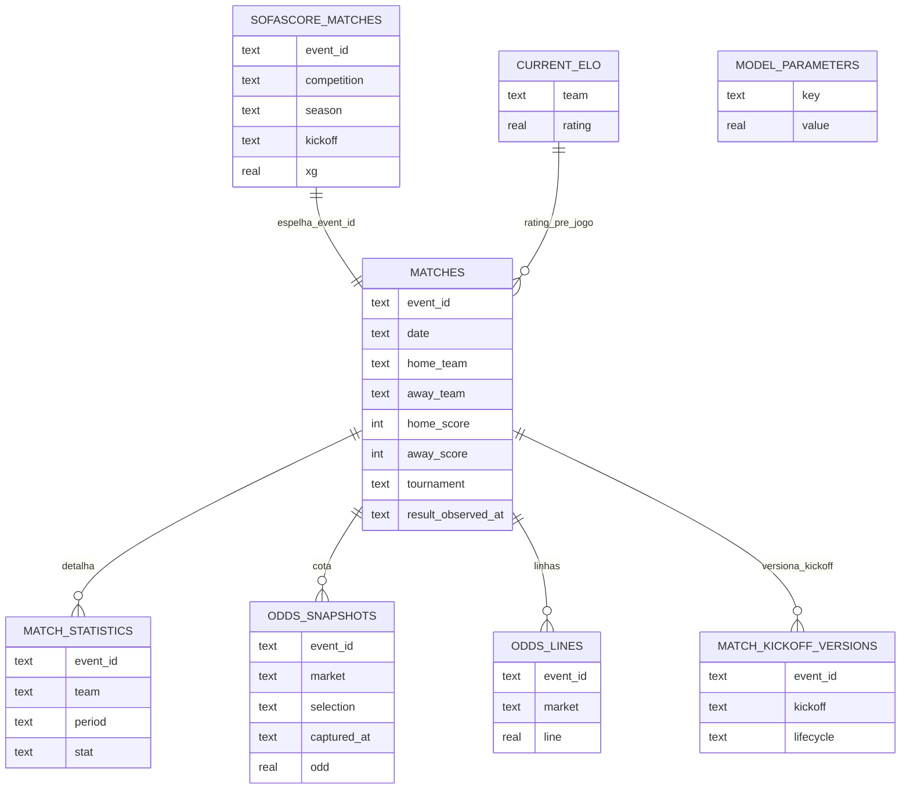

# Como funciona — brasileirao-predictor

## Leitura rápida e identidade

O projeto fornece previsão probabilística de partidas, coleta de futebol/mercado, pesquisa estatística, persistência de decisões/resultados, controles de prontidão e um kernel ligado a Redis/worker .NET. O comportamento precisa ser acompanhado por domínio, protocolo e fonte: nomes/comentários herdados da Copa/partidas internacionais ainda aparecem na CLI e no módulo ratings. O nome do projeto não prova que cada registro ou backtest seja exclusivo da Série A.

A referência é a árvore local `C:/BRASILEIRAO/brasileirao-predictor`, HEAD `f87806900d2aa3c5e267259a67f27ce56e18dc03`, branch main, versão fonte0.2.0. Há modificados e não rastreados preexistentes, entre eles prospective_metrics/prospective_protocol_v2 e testes. Os arquivos analisados são a árvore com essas alterações, não apenas git show HEAD. Hashes/baseline e diff estão em evidencias/brasileirao-predictor; main remoto consultado é outro SHA. Nenhuma atualização da origem foi feita.

## A — Responsabilidades e consumidor

O usuário pode servir uma previsão pela CLI, rodar kernel, coletar/acompanhar shadow e revisar relatórios de pesquisa. Consumidores adicionais: worker .NET via Redis e CAIN via exportação de relatos. `ecosystem_plugin.BrasileiraoPredictorPlugin` oferece somente health/capabilities. Health retorna WAITING estático e0.2.0, com nota de derivar saúde dos jobs. Capabilities anuncia supports_prediction True e collection True, settlement False, mas não implementa predict/collect/settle nesse módulo; a implementação executável está nas CLIs/scripts. Não confundir capability metadata com chamada funcional do protocolo de plugin.

O plugin expõe UNKNOWN científico/preditivo, NOT_VALIDATED econômico e FORBIDDEN capital. PredictionReadiness e prontidão operacional mantêm capitalFalse. Isso não é homologação do sistema completo ou confirmação de ausência global de caminhos financeiros; bet_log permite registros manuais, tratados como declarações não reconciliadas.

## B/C — Estrutura e tecnologias

Pacotes Python `brasileirao_predictor` (modelos, dados, interfaces) e `brasileirao_scripts` (coleta, pesquisa, shadow, protocolos). Research contém PIT, preço/força, validação prospectiva e experiências específicas. `dotnet/LineupWorker` é processo distinto com models/services/settings; seus testes são C#. `tools` inclui exportadores e laboratórios isolados. Contracts/schemas versionam odds/kernel/políticas. Workflows/Compose/Docker descrevem execução e CI, não instalação ativa.

Entradas manifest: brasileirao-predict→predict.main; brasileirao-kernel→kernel_cli.main; brasileirao-shadow→sombra_diaria.main; entrypoint predictor.plugins/brasileirao→ecosystem_plugin.PLUGIN. Python>=3.13,<3.15, Hatchling/uv, numpy/pandas/scipy, pydantic/settings, requests/truststore, PyYAML/jsonschema. Extras providers incluem parsers/curl-cffi; kernel inclui Redis/hiredis/numba. Worker usa .NET10 e lock NuGet; global.json e packages.lock.json foram lidos mecanicamente, sem restore.

pyproject→tool.uv.sources→uv.lock fixam Core3.2.1 e Ops4.2.1 pelas mesmas URLs/hashs observados em Crypto: Core `10ef42f34ace8bb2df5f83ff7de2ceec79b035a25ea0a690e8942bd60d2fb4e3`; Ops `da4fa540703879669caba919521ec7d3c33734b5d57781122823df8817346f0e`. Faixas>=3.2.1/<4 e>=4.2.0/<5 não são a versão instalada. Release/metadata/README sob mesma versão exigem comparação central em release-identity.json; ambiente operacional NV.

## D/H — Fluxo de previsão e caminho alternativo

1. predict.main lê config/catálogo e flags (times, fixtures, neutral, date, formal-context, formatos). `build` abre SQLite read_only, carrega current_elo/model_parameters, checa cache_is_current; ausência/staleness recalcula em memória e avisa, sem atualizar banco pelo serving.

2. Ratings produzem diferenças pré-jogo e parâmetros do modelo. Model.predict_match transforma Elo/perturbações em intensidades exp(a±b*diff/400), usa NegBin e ajuste Dixon-Coles dos placares baixos; grade fornece distribuição consistente1X2/OU/BTTS/top scores. market_pricer deriva outros mercados da grade, incluindo DNB/handicap asiático e push.

3. Ensemble_xg opcional mistura grades baseline e ataque/defesa, se habilitado e cache válido; falha usa baseline e avisa. Sem odds admissíveis, previsão matemática pode existir, mas comparação econômica não.

4. _market_probs procura dados entre times com data e orientação. Dados latest-state e odds retrospectivas não provam preço disponível ou oferta executável no instante da decisão. `show` emite evento, formata e chama prediction_log para congelar decisão JSONL; JSON de tela e registro persistido têm papéis diferentes.

5. formal_prediction.prepare_context/PredictionReadiness avaliam declarações temporais e completude, com evidência CALLER_DECLARATIONS_ONLY/provenance_verified False; mesmo ready True, pre_match/economic_evidence_eligible False. Aferição não autentica recibos por si.

6. settle casa prediction_id quando fornecido, times/data e orientação, valida gols, grava results.jsonl e notas. bet_log registra apostas/liquidações/banca manualmente, com locks locais e unidades históricas. Isso mede registros declarados, sem extratos/custos autenticados.

Fixtures: upcoming_fixtures filtra home_score NULL e date>=data local; limite por calendário não é relógio UTC de kickoff formal. Datas de CLI e timestamp aware dos contratos não devem ser misturados sem protocolo.

## E — Configuração

config.yaml governa escolhas científicas; Settings valida REDIS_URL redis/rediss, SPORTS_DB_PATH/MARKET_DB_PATH/VORP/TITULARIDADE/RUNTIME_DIR absolutos e isolamento entre os dois bancos. API keys e exchange endpoint são opcionais declarados; valores privados não foram lidos. Não executar worker/kernel só porque flags/defaults estão presentes: preflight precisa garantir Redis/bancos/caminhos descartáveis, entradas sintéticas e rede proibida ou explicitamente autorizada.

Compose e schedulers de fechamento/coleta/shadow são fontes de configuração. Nenhum agendamento foi instalado e nenhuma integração exchange ou bookmaker real acionada. Configuração efetiva da instalação e quotas/credenciais atuais permanecem NV.

## F — Dados, IDs e clocks

`db.SCHEMA` inclui matches(event_id UNIQUE; date/times/placares), sofascore_matches(event_id PK, competição/temporada/kickoff/xG/odds), match_statistics(PK event/team/period/stat), player_comp_stats, ratings, odds_snapshots(PK event/market/selection/captured_at), odds_lines(PK event/market/line), current_elo e model/xg parameters. `_migrate` acrescenta colunas/versões; read_only monta mode=ro/query_only e não migra. Write paths fazem upsert/commit. Odds snapshots INSERT OR IGNORE preservam novas fotos; odds_lines substitui close e usa COALESCE para abertura write-once.

result_observed_at é horário em que o banco viu placar, proxy de coleta, não horário de publicação original. match_kickoff_versions mantém versões de kickoff/lifecycle; identidade por event_id não deve ser inferida apenas de nomes. Schema/contratos são OD fonte; esta investigação não abriu bases privadas, portanto contagens/duplicação/coverage/freshness no banco instalado NV.

`feature_builder` SQL usa jogos anteriores por date e filtra estatística do lado certo home/away, reportando n_valid. Isso reduz lookahead por calendário mas não autentica available_at original de todas as estatísticas. PIT mais forte tem contratos próprios em research/pit_features e temporal_replay; existência de scaffolds não qualifica dados históricos automaticamente.

## G — Matemática e limites

- ratings.compute_ratings usa logística Elo, vantagem de casa, k por torneio/margem, decaimento e grupos temporais; quando há kickoff ausente em uma data, temporal_keys colapsa a data para evitar ordem fictícia. ratings_asof recompõe prefixos antes de datas, em vez de usar current_elo atual no passado.

- model.fit_goal_model ajusta máxima verossimilhança ponderada NB+DC, normalização NB dos fatores baixos, rho limitado via tanh, optional delta_xg e theta. Valida dados/solução, tenta Powell se L-BFGS-B não converge e levanta OptimizationFailedError se solução inválida; cold start para histórico vazio é explícito. Grade truncada/renormalizada e rho clamp mantêm consistência matemática; não demonstram calibração econômica.

- xg_model.fit estima forças ataque/defesa com alvo misto xG/gols, ridge e recência; depois alpha/rho nos gols reais. Mantém ok=ambos solvers success. predict usa forças0 para desconhecidos; blend mistura grades. Alegações de melhora numérica no docstring são DD históricas, não resultado recomputado aqui.

- dynamic_strength fit calcula resíduos observados/esperados com médias exponenciais curtas/longas, prior ridge e correções log-rate; deve receber só prefixo admitido pelo chamador.

- Price/edge/Kelly/EV e bootstrap em scripts/research são ferramentas de cenário; oferta aceita, mercado, limitações de stake, taxas e lucro pessoais exigem dados de execução. Classificações do plugin/prontidão não autorizam apostar.

## Protocolo prospectivo local novo

`brasileirao_scripts/prospective_protocol_v2.py` e metrics.py são não rastreados locais, não pacote publicado confirmado. PROTOCOL status SPECIFIED_NOT_ACTIVATED, capitalFalse, legacy/reconstructions inelegíveis. Família H14/H15 sucessora exige mesmas primeiras900 IDs, enrollment congelado, sem avaliações intermediárias. Baseline H14 usa Dirichlet1,1,1/Beta1,1, mínimo200, cutoff00:00UTC dia precedente, final_at e available_at estritamente anteriores. H15 propõe refit100 vs10; algoritmo NB/DC Elo congelado; ensemble desligado.

forecast_record exige probabilidades completas1X2/OU, janela24h antes kickoff, estado/fonte/configuração no escrow e hashes; receipt confiável é gate externo, hash sozinho não prova timestamp histórico. paired_sample rejeita IDs/placares/receipts inconsistentes, ausências/extras e não derruba silenciosamente outcomes. RPS=sum de dois erros cumulativos/2; log-loss piso1e-12; Brier1X2 soma3classes; BrierOU=2*(p_over-I[gols>=3])². Bootstrap moving não circular blocos21,10000, seed42/PCG64, CI percentil; degenerado p=1, não aprovação. Holm exige família completa e decisão primária+guardrails. scientific_claim_authorized permaneceFalse mesmo critérios atendidos, até autenticação prospectiva externa. Esta investigação não ativou protocolo, criou900 forecasts ou rodou inferência em coorte protegida.

`_prospective_evaluation_guard.evaluate_once` mantém claim exclusivo antes leitura/cálculo; sucesso/erro/crash conserva bloqueio, só AGUARDANDO_N libera seu próprio inode; publicação hardlink evita sobrescrever relatório. Copiar deliberadamente dataset está fora dessa trava e depende governança. Não foi executada avaliação H14/H15 real.

## Kernel Redis/.NET

Worker consome lineup_event, valida envelope/clock, calcula VORP por lookup, merge de lados e CAS em estado Redis; invoca kernel só com registro atômico/run atual. Kernel recebe elo/dvorp, calcula grade/fair odds e publica resultado correlacionado. Protocol v2 exige protocol_version, job_id,run_id,match_id,idempotency_key,state_version,timestamp_t3; state_version é decimal string positiva de Redis INCR com limite Int64 no runtime, sem ordering por relógio float. Fair odds result repete identidade e traz1/X/2/o25/u25 nullable >=1. Validade JSON não concede execução.

Fonte: Worker.Handle.../InvokeKernelAsync, MarketStateEngine, KernelRedisProtocolV2, kernel_daemon._handle_invoke/_poll_pending, contracts/redis-*.schema.json; testes runtime fencing/correlation/recovery existentes ET-SRC. Retentativas, watchdog e health oferecem recuperação; perda Redis/reconexão e shutdown estão previstos CI. Nenhum Redis/.NET/Compose executado nesta investigação; latências, recuperação real e executor ativo NV.

## Registros manuais e fronteira de capital

bet_log.book/liquidation/bank_state usa livros distintos, lock de escritores locais, timestamps ordenados, identificação de bets e unidade/moeda vigentes quando cada aposta foi anotada. Gross profit não reconcilia custos externos; valuation_status MANUAL_DECLARATIONS_ONLY/PENDING_RECONCILIATION e economic_evidence_eligible False. Fechamento admissível não é inferido de latest-state; CLV fica UNAVAILABLE_NO_ADMISSIBLE_CLOSING. Não usar saldo/PnL desse livro como extrato broker.

Prediction_log arredonda probabilities0.0001 e Elo0.1; registro formal inclui ID hash e contexto, mas o registro legado não preserva grade completa/fonte completa do ensemble. O protocolo sucessor exige precisão integral/escrow e impede reciclar legado. Paper ledger em research/prospective_validation checa duplicata lendo JSONL antes append; **limite OD:** read-check-append não possui lock/CAS nesse arquivo, portanto duas chamadas concorrentes poderiam admitir a mesma pick_id. Isso é risco INF pelo código, não corrida executada; não declarar idempotência concorrente certificada.

## Integrações e CI

Sofascore/FBref/APIFootball/Sportmonks/TheOddsAPI e pesquisa Oddspapi fornecem payloads normalizados para ingestão/proveniência/odds. São bordas externas; permissões/quotas e acesso atual NV. Core oferece matemática/contratos/proveniência e Ops runtime/jobs. Ecosystem descobre entrypoint de metadados. CAIN recebe cópia de relato por tools/export_cain_status: só docs/EVIDENCE_REGISTRY.md, SHA explícito, fonte commitada, offsets/status literal,3rows, destino novo fora checkout. Bundle admite registry e replay diagnóstico contaminado selecionados e declara falta de prediction/settlement admissível; não fabrica conclusão prospectiva. Uso histórico narrado README não foi tomado como OD atual.

CI configura Python3.13/3.14, Redis descartável com run_id e bancos de teste, Ruff/Pyright/coverage/build/installed CLI; .NET10, locked restore, runtime sintético cross-process,80% linha/branch; Compose sintético com perda Redis e shutdown. publication-validation possui allowlist de testes e bloqueios específicos; cain-export instala consumidor pinado. Runs atuais por SHA são investigação central em ci-head-local.json; contagens345/160 e3workflows12jobs README são DD/ET-HIST em outros SHAs, não nova execução atual.

ET-RUN:9 sondas Brasil em cópia independente sobre dois arquivos não rastreados sobrepostos explicitamente, runtime3.12/NumPy já disponível, sockets bloqueados. Reproduziram Brier/Holm/cutoff/smoothing/degenerado/mínimo/proibição capital/legado. Nada de pytest/core instalado, treino, provider, daemon ou coorte real. Clone checkout teve erro Windows caminho longo e foi reparado exclusivamente na cópia; logs e identidade preservados. Isso verifica componentes puros, não distribuição0.2.0 nem suporte integral runtime fonte.

## K/L — Confronto, cobertura e disponibilidade

PRELIMINAR foi salvo antes de ler README. README concorda com domínio científico+operacional, exportação documental, shadow e capital desabilitado; referências de entrega concluída referem SHAs datados diferentes da fonte/árvore estudada. A CLI/help e módulos que dizem internacional/Copa demonstram herança de escopo; não presumir que todos dados/cálculos estejam saneados só pelo nome brasileirao. Anexo A foi tratado como hipótese após descoberta; integração não prova lucro ou autorização.

Fonte é OD nesta árvore; lock é configuração OD; build/release investigados centralmente; instalação, banco efetivo, modelos ativos, schedulers/serviços são NV neste estudo. A-L estão mapeados com limites. Retomada de 2026-09-30 (Linux): coverage.json reconciliado com as coberturas de scripts (124 = 75 root + 35 shared + 14 applications), testes (210), .NET (42) e 26 arquivos residuais lidos no clone do remoto com hash idêntico à linha de base; restam 16 arquivos próprios não certificados (workflows, contratos JSON, pyproject, lock, schemas) cujos bytes locais diferem do remoto — ver retomada-residual-pendentes.json. Leitura AST não foi convertida em parecer integral. Diagramas em diagramas/brasileirao-predictor_{sequencia,estados,er}.mmd são INF dos contratos inspecionados. Próximo estudo deve terminar pendentes e testes isolados preservando alterações preexistentes, sem concluir homologação por números históricos.

Atualização de escopo: outra raiz com versão mais nova foi localizada. Consulte [suplemento de épocas e contratos locais](../SUPLEMENTO_RAIZES_DOMINIOS.md). Não misturar interfaces/finding desta fonte primária com a alternativa.

Aprofundamento adicional: `brasileirao_predictor/backtest_event.py`: Revisão integral: joins periodALL, Elo por data, dedup treino event_id com identidade validada, split80% eventos por dia, exclui boundaryday treino, poisson event model, only half lines probability finite, odds>1, edge abertura strict threshold, prioridade over se ambas, CLV abertura/close-1, unit scenario no fees, bootstrap event clusters1000seed42; conditional_price_scenario_not_execution. Timestamps publicação/execução não demonstrados.

`brasileirao_predictor/event_models.py`: Revisão integral fit/predict: finitos e contagem inteira, Elo/400 + feature difference, links exp(a±drift), NB var mu+alpha mu², bounds/LBFGSB initPoisson, fallback mean-only marcado, economicFalse. Predict soma NB via convolução finita CDF, Poisson soma intensidades; grades half0.5..9.5. Forecast depende de features previamente PIT; convergência marcada não demonstra calibração.

`brasileirao_predictor/a1_phase0.py`: Ledger JSONL hashchain fingerprint e proibição recursiva chaves outcomes; append lê antes de escrever sem lock local; referência completa mesma capture book/event OU25 usando mínimo proporcional/Shin, faixa é sensibilidade não CI; CLV sample z²sd²/mde² design effect; operational calibration costs null capitalFalse.

`brasileirao_predictor/a1_recommendation.py`: Revisão integral: grossEV p*odd-1, lowerP=max0(p-uncertainty), netEV lowerP*odd-1-friction; hard gates completude/executável/stale/EV; cap10 PHASE0 cap40 SHADOW cap100 demais estágio com lowerCI>0 presumido; action só shadow/no bet capitalFalse. Literal não validado runtime; NaN clv lower não é rejeitado e comparação<=0 resultaFalse, permite cap100. Necessário validar stage e finiteCLV; prova sintética a seguir.

`brasileirao_predictor/data/bitemporal_store.py`: Todas funções revistas: awareUTC publicados<=ingest, payloadfinite canonical SHA, PK inclui charter e clocks/content; schema legado PK difere recusado, append ignorado idempotente, asknownat published<=t & ingested<=t dense_rank newest, empate versão conflicting recusado, charter explícito para múltiplos. event_at não filtrado em asknownat (útil fixtures futuras) e published fornecido não recibo verificado.

`brasileirao_predictor/data/prospective_shadow.py`: Todas funções revistas: hash conteúdo, campos pick/result required, UTC, predicted<kickoff e captured<kickoff; synthetic/Test picks recusados. Não compara odds_captured_at<=predicted_at; settlement não compara result.pick_id ao pick.pick_id nem closing_definition_version de ambos, nem chama validate_pick; contrato local mais fraco que escrow successor não rastreado. Callers podem suplementar guardas; não atribuir execução contaminada.

`brasileirao_predictor/backup_restore.py`: Integral: links/junction refused source/dest trees, guard recursivecopy, new root only, tempuuid, onlineSQLite perDB backup matches+optionalodds; ledgers/directories plaincopy; SHAmanifest content+SQLite integrity verify; restore validates twice and keeps failed forensic destination. Multi-artifact backup no globaltransaction; runtime subdirectory SQLite plaincopy could include active WAL dependencies, not proved coherent live. No execution of primary backup; alternate recovery synthetic tested separately.

`brasileirao_predictor/research/economic_decision.py`: Integral: rejects bool/nonfinite, coherent bounds, complement lower=1-upper, EV flat friction, threshold strict>, fractionalKelly EV/((odds-1-friction)*(1+friction)), capstake, chooses maxone side conservativeEV. Stake fraction referencebankroll not cash; capitalFalse economicFalse no operational release.

`brasileirao_predictor/research/calibration_gate.py`: Integral declaration gate: required RPS/Brier/LL/BrierDraw finite deltas; negativeDraw + RPSgain>=.002 + nonworse BrierLL and requiredHomeLL. GO only candidate new prospectiveprotocol provenanceFalse servingFalse capitalFalse; no confidence family trialproof.

`brasileirao_predictor/data/market_anchor.py`: Integral: same sourceevent/line and singleawareUTC capture, complete expected sides/book, odds>1 and overround>1, proportional no-vig eachbook then median normalized; offeringbook removed reference, bestobserved odds allbooks; eligibleFalse observednotexecutable. Persist normalized COLLECTION_ONLY. Authentication/available_at not supplied here.

`brasileirao_predictor/data/promotions.py`: Integral loaders validate duplicateJSON, schema, officialCBF URLprefix declaration only, team/season uniqueness finalposition1..4 BtoA+1 complete, relegation17..20 complete; no network fetch or sourceauthentication. Not prospective availability metadata.

`brasileirao_scripts/backtest_walkforward.py`: Integral current modified workingtree423lines: sort ratings.temporalkeys, datealigned blocktarget firstburnin, calibration window strictdate<blockdate>=100 weightedrecency, Elo pregame history; frozen params eachblock, openingodd scenario helpers; H2pastHTfraction>=50 periodprob>=.6 accuracy only. LegacyH1GO n30 PSR.8 clusterPnLCI>0 DSR.95; outputs CSV/summary writes no execution performed. No publicationclock escrow for historicaloffer; plaindate manifest diagnostic. DSR validation delegated Core; label GO not capitalauthorization.

`brasileirao_predictor/prediction_protocol.py`: Integral Pydanticextraforbid/Literal/strict boolint nonnegative goals/aware clocks; chronology cutoff/trainingresult/kickoff lineup odds/currseason completeness, pre/liverequirements, capital blocked. Return ready contractdeclarations only provenanceFalse/evidenceFalse, simulationwarning. Checks aggregate latestdeclared timestamps no actual datasetreceipt validation.

`brasileirao_predictor/identity.py`: Integral canonical catalogs required aliasesversion, normalization NFKD casefold, slugtargets and aliascollisions rejected; exactcanonical thenalias, fuzzy suggestiononly cutoff.72 rawalias (not autoresolution); legacyinternational loweraliases remaining. Versionlabel identity not timestamped mapping provenance.

`brasileirao_predictor/elo_baseline.py`: Integral Coreprequential subclass trainqueues history, predictfit truncates kickoff<target prohibits simultaneouskickoff, reruns ratingsK20 HA80 init1500 drawratehistorical, 1X2 factorizedconstantdraw, predicted_at maxtrainingkickoff. Does not filter result_available_at here: kickoffprior alone cannot exclude unfinished simultaneousoverlap/laterknown results; Core orchestration/input admission may further filter. K/homeadv not locally validatedfinite; no empirical result executed.

`brasileirao_predictor/evaluator.py`: Integral: Coreprequential targetresult hooks lazy queuedfit, usable kickoff<target, >=2teams, DC decay relative maxtrainingkickoff fit strengths/default1/rhoclamp pernewmatch, output 1X2predicted_at maxtrainingkickoff. Same kickoffblock exclusion lacks availabilityreceipt locally like EloBaseline; maxtrainingkickoff not trueknowledge timestamp. Resultblindness targetkey conditional no extra labels elsewhere.

`brasileirao_predictor/research/temporal_replay.py`: Integral: materialize TemporalPolicy groups uniquenessperteam, SHA canonical sourceorderedrows, temporal policyfingerprint/precision/counts; manifest documents grouping not causal publication proof; fallback groupdate available.

`brasileirao_predictor/data/lineup_envelopes.py`: Integral: sourceeventteamparser/rawSHAawareUTC observed/published<=received, complete onlyplayers, uniqueid validrole, sortplayers, finiteJSONcanonical, CAS oslink atomic immutable tempflushfsync, retries bytecompare, read filehash+canonical+identityduplicateJSON reject; asof byreceived<=cutoff single source latestteam and sameclockconflict reject, invalid/unavailable omit vs removedempty. rawhash identity not sourceauth; hardlink publish used only internalartifact, no originalread/writes study execution.

`brasileirao_predictor/backtest.py`: Integral594lines em dois blocos: odds latest/open stored pairednames ±3day closest with tie first, no uniqueevent/capture receipt guarantee; extBTTS/DC/halfOU no push. Settlement preferopening elseclose explicitlytagged, gate p-1/odd minstrict maxinclusive, unitPnLno fees, CLV odd*closingShin-1 diagnostic. Frozenfit calibration strictdate except fallback indexprefix if empty/no config: indexprefix may include same date target; chronology availability absent. CLI writableDB DROP/CREATE backtest_bets and CSV rewrite (study never executed). ForwardElo dependent ratings policy; closepopulation inherentlynotexecution, opencolumn alone no independent provenance.


## Épocas remotas observadas

Os manifests do main remoto e os assets do Anexo foram verificados separadamente, por SHA/versão. Veja [confronto do Anexo](../CONFRONTO_ANEXO_REMOTO.md). Essas identidades não ampliam automaticamente a cobertura semântica da raiz primária nem provam integração runtime.

## Diagramas (modelos INF sobre os módulos e contratos inspecionados)

Os quatro arquivos abaixo existem em `diagramas/` e estão incorporados aqui; são modelos de leitura, não máquinas de estado literais do código. O diagrama de componentes inclui, tracejados, os adapters V2 que só existem na época `main` (ver [suplemento da época](../SUPLEMENTO_EPOCA_MAIN_20260930.md)); os demais nós vêm da época original.

### Componentes



### Sequência

```mermaid
sequenceDiagram
 participant U as Usuário (brasileirao-predict)
 participant P as predict.build/show
 participant DB as SQLite matches (read-only)
 participant MO as model.predict_match (NB + Dixon-Coles)
 participant MK as market_pricer
 participant L as prediction_log (JSONL)
 U->>P: times, data, flags
 P->>DB: current_elo, model_parameters, cache_is_current
 alt cache ausente/obsoleto
  P->>P: recalcula em memória e avisa (não grava no banco)
 end
 P->>MO: diferenças de Elo + parâmetros
 MO-->>P: grade de placares (1X2/OU/BTTS)
 P->>MK: derivar mercados da grade
 P->>DB: _market_probs (odds latest-state, sem prova de oferta executável)
 P->>L: congela decisão antes do resultado (prediction_id)
 L-->>U: saída formatada; PredictionReadiness capital=False
 Note over U,L: settle casa prediction_id e grava results.jsonl; bet_log é manual/declarativo
```

### Estados

```mermaid
stateDiagram-v2
 [*] --> REGISTRADO: Worker registra escalação (Lua atômico, INCR state_version)
 REGISTRADO --> PENDENTE: request 60 s + identity + pending
 PENDENTE --> EM_CALCULO: kernel obtém lease 5 s (versão atual)
 EM_CALCULO --> PENDENTE: lease expira / falha conhecida (recuperável)
 EM_CALCULO --> CONCLUIDO: dono atual grava fair_odds (≤5 s) + ready
 CONCLUIDO --> PUBLICADO: MSE compara no Redis e publica lote na signal_outbox
 CONCLUIDO --> EXPIRADO: validade original esgotada
 REGISTRADO --> INVALIDADO: nova versão / watchdog fallback
 PENDENTE --> INVALIDADO
 PUBLICADO --> [*]: sinal com expires_at; nenhum executor financeiro
 note right of PUBLICADO: Contrato brasileirao.redis/2 (contracts/redis-protocol-v2.md); modelo INF do texto e do kernel revisados
```



### Esquema


