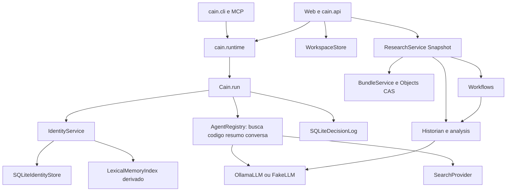
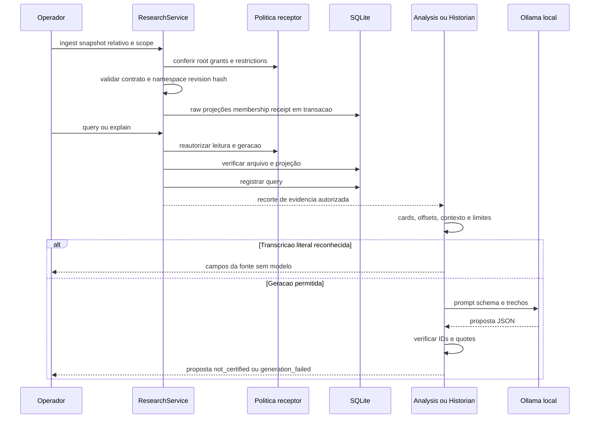
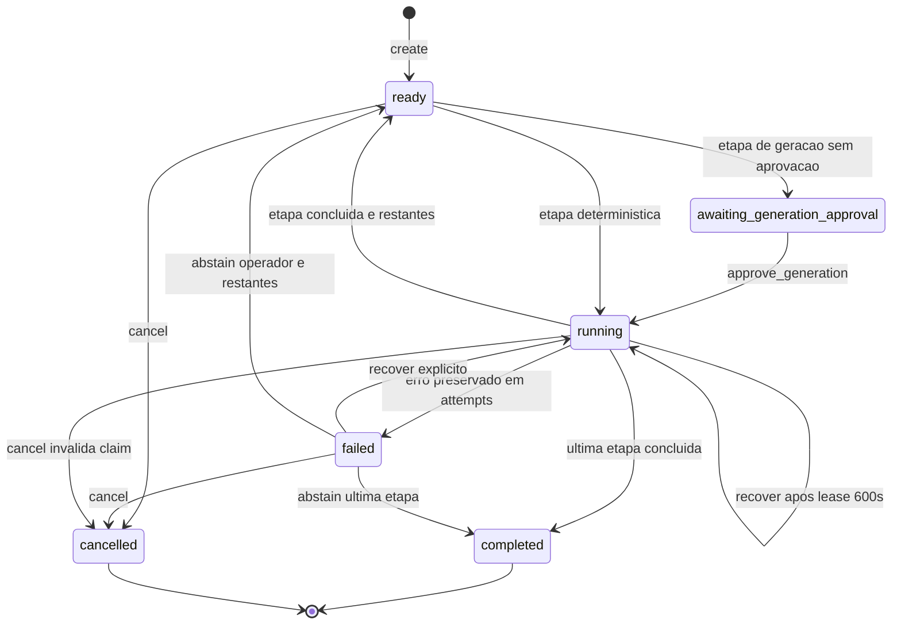
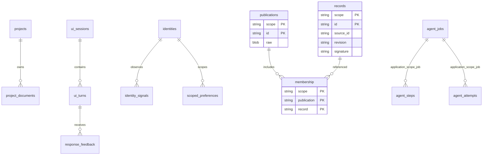

# Como funciona o CAIN observado

A árvore local 0.4.12 fornece duas trilhas: conversa com identidade explícita e consulta de pesquisas recebidas por Snapshot/Bundle. Os elementos abaixo são OD de código; setas expressam chamadas ou relações de aplicação. Nenhum diagrama prova serviço ativo. Os arquivos e hashes estão em `evidencias/cain/hash(es).json`, `source-index.json`, `coverage.json` e `REGISTRO.log`.

## Componentes



`runtime.build_cain` seleciona as implementações concretas dos ports de persistência, registra os agentes e escolhe o router. A API cria o WorkspaceStore e monta pesquisa; são bancos locais e arquivos, sem leitura direta automática de toda raiz produtora. O provedor de biblioteca pode ser FakeLLM; a configuração de aplicação escolhe Ollama.

## Conversa e recuperação

```mermaid
sequenceDiagram
 participant U as CLI ou API
 participant W as WorkspaceStore
 participant C as Cain.run
 participant I as IdentityService
 participant A as Agent escolhido
 participant P as LLM opcional
 participant D as DecisionLog
 U->>W: validar projeto e sessao; claim_run na API
 U->>C: payload e ids
 C->>I: observe e context_for
 I-->>C: identidade e contexto autorizado
 C->>A: Message por rota
 opt Geracao necessaria
 A->>P: prompt e contexto
 P-->>A: response ou erro
 end
 A-->>C: texto
 C->>D: mediated com response_hash
 C->>I: persistir interacao
 C->>D: completed e outcome na API
 D-->>W: run_receipt ready
 W-->>U: resposta; restore_turn sem nova geracao
```

`Cain.run` observa preferências apenas no `user_input` explícito, carrega contexto por escopo, escolhe agente e registra decisões. Preferências reconhecidas ignoram citações, blocos colados, desejos de terceiros e ambiguidades. A resposta gera hash e dois eventos separados: mediated e completed. Na API, completed e outcome permitem reconstruir a UI sem repetir inferência. O Lock de geração é por processo; não é lock distribuído. Uma identidade de usuário é isolamento local de dados, não autenticação.

Aritmética tem parser AST limitado e Fraction, sem execução geral de código. SearchAgent prioriza trechos documentais e só recorre ao histórico do usuário quando não há fonte recuperada. Busca literal não certifica completude. CodeAgent produz texto e não executa o resultado.

## Recebimento e explicação de pesquisa



A identidade do Snapshot usa namespace do produtor, source_id e revision, com assinatura de conteúdo e evidências. Raw é autoritativo; projeções são verificadas/reconstruíveis. Revisões coexistem sem regra automática de mais recente. Consulta reautoriza e grava auditoria em `queries`, por isso não é um comando forense somente leitura. Bundle possui controles próprios para metadata e CAS; o workflow de seis etapas usa evidências Snapshot, conforme `coverage.workflow_input=snapshots_only`.

Na trilha de IA: fonte recebida → operação read/generate autorizada → recorte com offsets/contexto → prompt e schema → Ollama → JSON/IDs/quotes verificados → proposta. `semantic_support=not_certified`, `memory_promoted=False` e `proposals_only=True` tornam o limite explícito. Uma citação literal não demonstra que a interpretação é correta. Transcrição de tabelas reconhecidas é determinística e evita paraphrase do modelo.

## Estados do workflow



`Workflows` fixa question, protocolo research-workflow/19, identidade do modelo e fingerprint da política/corpus. Geração requer aprovação explícita; falhas mantêm tentativa. `recover` permite nova tentativa e lease expirada após 600 segundos; `abstain` é checkpoint do operador, sem aceitação do output falho. `awaiting_generation_approval` é estado devolvido ao cliente, não status persistido de job. A contagem de chamadas do modelo cobre receipts concluídos; chamadas em falhas são desconhecidas.

## Esquema



As relações de agent_jobs/steps/attempts no desenho são relações por chaves da aplicação, não FKs declaradas nesses CREATE TABLE. Identidades, workspace e pesquisas têm schemas separados. Bundle possui ainda reservas globais de entidades, aprovações e variantes raw. Arquivos de documentos e CAS permanecem fora do SQLite e são conferidos por hash.

Backup completo tira snapshots independentes de workspace e research e copia documentos/CAS imutáveis. O manifesto declara essa consistência; não há transação única entre os dois bancos. Restore exige diretório novo e ativação manual após revisão da política.

## Ordem de leitura

Comece por pyproject.toml, settings.py, runtime.py, orchestrator/__init__.py, agents/__init__.py e workspace.py. Depois identity/explicit.py e persistence/adapters/sqlite.py. Para pesquisa: service.py → objects.py/bundles.py → inspection.py → grounding.py → analysis.py/historian.py → workflows.py. Evaluation, harnesses de CI e relatórios antigos ficam para a segunda passagem. A revisão integral desses últimos continua pendente no coverage.json.
