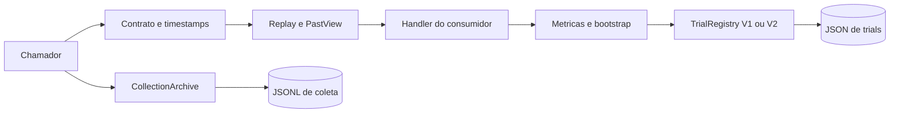
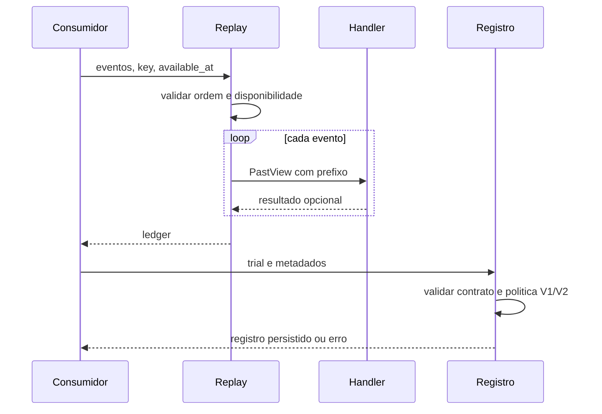
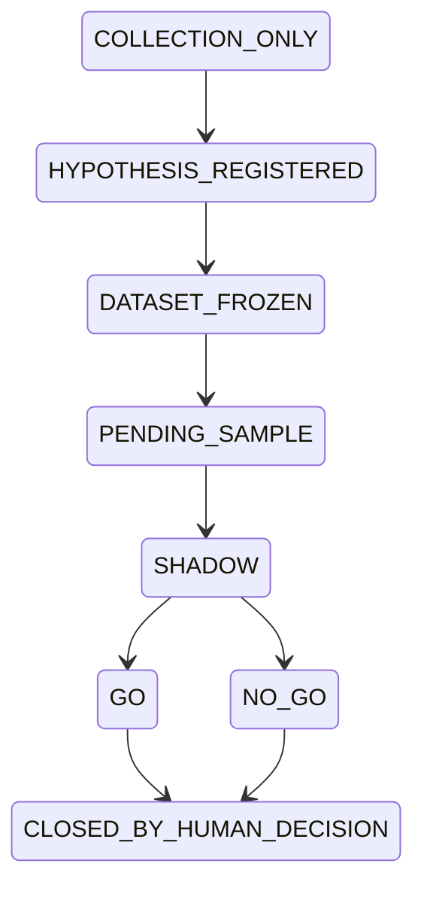

# Como funciona: core-predictor

Fonte primária: `C:\PREDICTORS\core-predictor`, HEAD `9bf43efe92459a0b484cac00f51170b2c70d420f`, branch `main`, versão declarada `3.2.1`. `origin/main` local e remoto ficam separados em baseline.json. Este texto descreve essa fonte, não substitui estudo da raiz de qualificação ou do servidor.

Biblioteca de contratos científicos, medição estatística, replay temporal e infraestrutura reutilizável. O checkout não é um preditor treinado nem um executor de ordens.

OD=observação direta; DD=declaração; ET-SRC=teste existente; ET-RUN=teste desta investigação; NV=não verificado. Todas as referências abaixo remetem ao hash em evidencias/core-predictor/hashes.json e ao registro append-only.

Caracterização preliminar salva antes da narrativa do repositório; o Anexo A foi exposto na leitura inicial do pedido, limitação de independência explicitamente registrada em PRELIMINAR_core-predictor.md. Nenhuma memória prévia foi usada.
## A. Propósito

Contratos, medição e utilidades sustentam a responsabilidade compartilhada declarada. Não foi encontrado modelo treinado ou autorização de capital nos módulos próprios src/predictor_core integralmente examinados.

## B. Estrutura

Pacote src/predictor_core com scientific/data/measurement/stats/kernel/net/infra/collection/testing e fachadas de compatibilidade. Sem project.scripts no manifest observado; scripts de auditoria e verificação de wheel são entradas auxiliares.

## C. Ambiente

Python >=3.13, dependências raiz vazias; extras http/httpx e scraping/curl-cffi, dev/test/arquitetura. uv.lock foi parseado integralmente; identidades em dependency-identities.json. Python 3.12 inicial fica fora do suporte declarado; leaf smoke posterior usa 3.13.14.

## D. Interfaces

Chamadas de biblioteca recebem objetos/dados/callbacks e retornam contratos, métricas ou registros. Download grava destino do chamador; bancos, trials, eventos e arquivo de coleta persistem quando APIs são invocadas. Erros de validação não promovem estado automaticamente.

## E. Configuração

Parâmetros de timestamps, cutoff, sementes, blocos, SLA e recursos nos contratos; PREDICTOR_EVENTS_PATH seleciona destino de eventos; endpoints/headers/segredos por argumentos. require_secrets testa presença/formato, sem autenticar serviço.

## F. Dados e persistência

DatasetFreeze sela metadados/partições SHA256 sem recuperar origem. PredictionPoint congela estruturas comuns recursivamente; tipos customizados podem continuar mutáveis. Trial V1 JSON histórico, V2 JSON prospectivo, coleção/eventos JSONL, SQLite migrações. Nenhum banco original foi aberto.

## G. Algoritmos e decisões

Métricas probabilísticas, DM com correção HLN, PSR e bootstrap estão implementados. Não há treinamento inferido pelo nome predictor. Premissas de distribuição, alinhamento de séries, causalidade econômica e seleção permanecem externas.

## H. Fluxos completos

Replay valida ordem e disponibilidade, fornece PastView ao handler e reúne ledger. V1 valida trial, adquire lock, verifica atestado quando exigido, preserva superseded e substitui JSON. V2 valida contrato, rejeita id repetido e substitui JSON; precisa controle externo para concorrência.

## I. Testes

test-assertions.json cataloga testes por função/símbolo, incluindo contratos, métricas golden/sintéticas, travas, provenance e harness. Não executamos pytest completo. Smoke inicial falhou no import por metadados ausentes; três testes de leaf em 3.13 passaram; não são validação da instalação ou ciência real.

## J. Operação

CI declara Python3.13/3.14 experimental, uv frozen, lint/pyright/import-linter/coverage80, builds e wheel instalada isoladamente. Script sync_core é auditoria de cópias e não foi executado. Execuções atuais do Actions pertencem ao bloco remoto consolidado.

## K. Documentação e pendências

README3.2.1 concorda com biblioteca compartilhada e separação ciência/coleta. Documento de migração impresso por sync_core.py ainda cita2.3.0: texto de compatibilidade histórico, não versão atual. Anexo A cita3.2.2; o HEAD local3.2.1 é uma época diferente.

## L. Fonte e artefato em uso

Fonte local identificada pela baseline; clone independente no mesmo HEAD. Não houve wheel instalada deste checkout nem serviço ativo validado. Import inicial com fonte sem metadata falhou; smoke leaf evita fachada e não demonstra artefato distribuído.

## Componentes centrais

|Componente|Fonte e símbolo|Comportamento e limite|
|---|---|---|
|fachadas|`src/predictor_core/__init__.py`::__getattr__ (SHA256 `172f0b30af694e5f2e4e9a3ce9154eca753e9917e93c9b9a8efa9c45c30df490`; leitura em REGISTRO.log)|Exportações lazy; versão obtida de importlib.metadata; import da raiz requer distribuição instalada.|
|contratos|`src/predictor_core/contracts/scientific.py`::DatasetFreeze (SHA256 `0cdf9e31d11105fa336405e38afd554f0fb6ecc635edd09dea4a83d204de8045`; leitura em REGISTRO.log)|Charter, SLA, recursos e congelamento com hash; validação estrutural e temporal de metadados.|
|dados|`src/predictor_core/data/contracts.py`::PredictionPoint (SHA256 `33476efcd3691ca876c1a5f5441925819808a68f5fc5fd25dfbb8088a453df73`; leitura em REGISTRO.log)|OHLCV, sinal com proveniência e previsão; providers abstratos; não busca dados por si.|
|roteadores|`src/predictor_core/data/router.py`::FallbackRouter (SHA256 `b705467dc8f292026b6722d467786ad557e0b8b39e07523d1e565a554ef76d7b`; leitura em REGISTRO.log)|Fallback sequencial aceita retorno sem exceção inclusive lista vazia; AggregationRouter consulta em paralelo e exige sobreviventes não vazios, aplica mediana/média por timestamp.|
|circuito|`src/predictor_core/data/circuit_breaker.py`::CircuitBreaker (SHA256 `3552515b5fa500982be462e5b959649e72659d29f7fcd062d0fe4aa58d1280d9`; leitura em REGISTRO.log)|Closed/open/half_open com contador e monotonic clock; libera uma probe e emite evento nas transições.|
|qualidade|`src/predictor_core/data/source_quality.py`::source_quality_scorecard (SHA256 `dba7d377308f361d231df0a2850ebda88e0aee41e7952def280e99a029ad4205`; leitura em REGISTRO.log)|Coverage/freshness/gaps/revisions/availability/divergence; causality/integrity violadas levam QUARANTINED. Freshness calcula ingested-published, não idade atual do dado.|
|ajustes|`src/predictor_core/data/quality.py`::infer_split_factor (SHA256 `942f1012e271e5ced989a4b77adc3ed820ce6e80a35d3763e989183edcaa5f9e`; leitura em REGISTRO.log)|Heurística de splits razão2/3/4/5/6/8/10 com tolerância; ajustes aplicam fator às datas anteriores e não recuperam corporate action oficial.|
|replay|`src/predictor_core/measurement/replay.py`::PastView (SHA256 `f4a2854e8a68c9532c8256ab94d6e9d7c68fac6d50fcf5298980d6b4830accec`; leitura em REGISTRO.log)|Iteração com prefixo passado e ordem temporal opcional; available_at pré-validado; objetos de eventos continuam referências compartilhadas.|
|métricas|`src/predictor_core/measurement/metrics.py`::brier (SHA256 `b8fda9f55369aafbd0a8a35da2f2be255446a122ae7826a0fb6291d67be69b68`; leitura em REGISTRO.log)|Brier/log-loss/RPS/calibração/Diebold-Mariano; as entradas continuam exigindo premissas estatísticas do chamador.|
|estatística|`src/predictor_core/measurement/stats.py`::sharpe (SHA256 `a3d4a956ca19e3dd62c94651c7d5015649380ca9b797bf57681bfcd337a6136c`; leitura em REGISTRO.log)|Sharpe, Sortino, drawdown, PSR e correlações; não substituem avaliação econômica prospectiva.|
|bootstrap|`src/predictor_core/measurement/bootstrap.py`::bootstrap_ci (SHA256 `39b8105f530ba77424fc5270fd408c57796ea2d4fb7c298f5928adab869c6b4b`; leitura em REGISTRO.log)|Reamostragem iid, moving, stationary e cluster; estatísticas não finitas são filtradas e a cobertura é condicional às réplicas válidas.|
|registro V1|`src/predictor_core/measurement/trials.py`::TrialRegistry (SHA256 `3b66f38e6c5808e183e5d06e0fc3970fac9cd9f93d0c1eb4280ae697b0fcef8c`; leitura em REGISTRO.log)|Registro JSON com trava PID, atualização atômica, histórico superseded e power attestation; bypass explícito power_attestation=False.|
|registro V2|`src/predictor_core/contracts/trial_v2.py`::TrialRegistryV2 (SHA256 `05f17f4f6d4169769b74804c3cca3be717099f4fa4d8638a1404f97183bc8e0a`; leitura em REGISTRO.log)|Registro prospectivo com seleção e proveniência exigidas; read/append/replace não tem a trava do V1.|
|coleção|`src/predictor_core/data/collection.py`::CollectionArchive (SHA256 `24b30e2e77c9d7053927ce0765f03c048edb488d27ca2365d513de150e4f785b`; leitura em REGISTRO.log)|Histórico JSONL com ciclo de coleta; proíbe converter coleta automaticamente em trial científico.|
|kernel|`src/predictor_core/kernel/jsonl_store.py`::JsonlStore (SHA256 `d3b0281c20eb40d32e6444c9810509bc2d59d307b4dad6d47c85a67242cc01dd`; leitura em REGISTRO.log)|SQLite/WAL/migrações e JSONL/fsync; funções só produzem efeitos quando chamadas.|
|SQLite|`src/predictor_core/kernel/infra.py`::connect (SHA256 `f619bc31df62c5dccfca9fcac937a742bd67d474cd618d05b07305341361b21a`; leitura em REGISTRO.log)|Abre SQLite com WAL,busy_timeout,foreign_keys; run_migrations rastreia nomes aplicados em _migrations.|
|meta|`src/predictor_core/kernel/meta.py`::validate (SHA256 `a5d31fd26a2e9d4a334fef232da456d645730ab71dc0c78240395ba5d6dd2c0f`; leitura em REGISTRO.log)|Fingerprints de arquivo/parametrização e gate StaleModelError; não garante adequação científica do modelo.|
|prequential|`src/predictor_core/testing/prequential.py`::PrequentialEvaluator (SHA256 `e635905ab8cb751fd5f57f9e9de0498b440e55eb15b4ba908ff21aee790095ad`; leitura em REGISTRO.log)|Orquestra callbacks train/predict em progressão temporal; algoritmo/modelo é injetado pelo consumidor.|
|rede|`src/predictor_core/kernel/net.py`::download_file (SHA256 `cbc64c72d9c8a6bbdb8c767500903dc64d06bff74512c7f2c5a25c2a73efe079`; leitura em REGISTRO.log)|Downloads temporários/retry/replace; HTTPX e curl-cffi opcionais; endpoints pertencem ao chamador.|
|harness|`src/predictor_core/testing/harness.py`::attest_pipeline_power (SHA256 `cb4ab95b439abaffba9698392fe45a7625fc67a6bb5a2a1783d9a61c74cf6d5a`; leitura em REGISTRO.log)|Callbacks sintéticos de edge e noise produzem atestado temporal; não confirma lucro ou capital.|

## Achados rastreáveis

**CORE-01 [OD/ET-RUN] — Fachada exige distribuição instalada.** Import de fonte em cópia sem metadata falhou PackageNotFoundError. Não prova defeito de wheel instalada. Fonte: `src/predictor_core/__init__.py`::__version__ (SHA256 `172f0b30af694e5f2e4e9a3ce9154eca753e9917e93c9b9a8efa9c45c30df490`; leitura em REGISTRO.log); artefato `evidencias/core-predictor/smoke-run.txt`.

**CORE-02 [OD] — Concorrência V2 não herda trava V1.** Read/append/replace analisado integralmente; testes existentes não comprovam escritores concorrentes V2. Fonte: `src/predictor_core/contracts/trial_v2.py`::TrialRegistryV2.register (SHA256 `05f17f4f6d4169769b74804c3cca3be717099f4fa4d8638a1404f97183bc8e0a`; leitura em REGISTRO.log); artefato `evidencias/core-predictor/source-catalog.json`.

**CORE-03 [OD] — Replay limita visibilidade mas compartilha eventos.** Handler só recebe prefixo; referências mutáveis e ambiente externo não são sandboxados. Fonte: `src/predictor_core/measurement/replay.py`::PastView (SHA256 `f4a2854e8a68c9532c8256ab94d6e9d7c68fac6d50fcf5298980d6b4830accec`; leitura em REGISTRO.log); artefato `evidencias/core-predictor/leaf-smoke-run-313.txt`.

**CORE-04 [OD] — Bypass explícito do atestado V1.** power_attestation=False é caminho de API; consumidores devem decidir e auditar política. Fonte: `src/predictor_core/measurement/trials.py`::register_trial (SHA256 `3b66f38e6c5808e183e5d06e0fc3970fac9cd9f93d0c1eb4280ae697b0fcef8c`; leitura em REGISTRO.log); artefato `evidencias/core-predictor/source-catalog.json`.

**CORE-05 [DD/OD] — Versão do Anexo difere desta fonte.** 3.2.1 local versus3.2.2 no Anexo; conclusão restrita ao checkout. Fonte: `pyproject.toml`::project.version (SHA256 `4b1140580af5cf392973be2b42302ef0b988ffba37fe042c0e3aac12a727401f`; leitura em REGISTRO.log); artefato `evidencias/core-predictor/baseline.json`.

## Integrações

|Origem → destino|Mecanismo e fonte|Payload, confiança e erro|Estado|
|---|---|---|---|
|consumidor Python → core|import/chamada síncrona; `src/predictor_core/__init__.py` (SHA256 `172f0b30af694e5f2e4e9a3ce9154eca753e9917e93c9b9a8efa9c45c30df490`; leitura em REGISTRO.log)|contratos, dados, métricas; sem autenticação própria; callbacks/providers do consumidor; erros tipados de validação|OD/ET-SRC; leaf ET-RUN|
|core download → HTTP externo|urllib/HTTPX/curl-cffi; `src/predictor_core/kernel/net.py` (SHA256 `cbc64c72d9c8a6bbdb8c767500903dc64d06bff74512c7f2c5a25c2a73efe079`; leitura em REGISTRO.log)|bytes para arquivo destino; headers/URL injetados pelo chamador; retry transitório e arquivo temporário|OD/ET-SRC; rede NV|
|core registro → filesystem/SQLite|leitura e gravação local; `src/predictor_core/kernel/jsonl_store.py` (SHA256 `d3b0281c20eb40d32e6444c9810509bc2d59d307b4dad6d47c85a67242cc01dd`; leitura em REGISTRO.log)|JSONL, JSON trials, SQLite; permissões do processo; sem grants de capital; fsync/replace; lock V1; V2 sem lock|OD/ET-SRC; banco real NV|

## Diagramas

## Cobertura, limites e continuidade

Código próprio executável, testes, CI, schemas, manifests e lock selecionados constam em source-catalog.json e coverage.json por módulo. Testes foram lidos, mas a suíte completa não foi executada. Documentação narrativa/histórica é amostrada: README, ARCHITECTURE_IMPLEMENTATION, HANDOFF e documentos materialmente relacionados a conflitos; inventário Git delimita os demais. Caches, terceiros, builds e ambientes não foram qualificados como código próprio. Nenhum treinamento, backtest amplo, API paga, instalação pesada, agendamento ou capital foi acionado.

Próximo bloco: confrontar raízes alternativas separadas, finalizar cadeia de assets/README da wheel e CI remota no estudo consolidado. Nenhum ET-RUN limitado deve ser generalizado para estado científico, lucro, autorização de capital ou funcionamento de instalação real.

## Épocas remotas observadas

Os manifests do main remoto e os assets do Anexo foram verificados separadamente, por SHA/versão. Veja [confronto do Anexo](../CONFRONTO_ANEXO_REMOTO.md). Essas identidades não ampliam automaticamente a cobertura semântica da raiz primária nem provam integração runtime.
