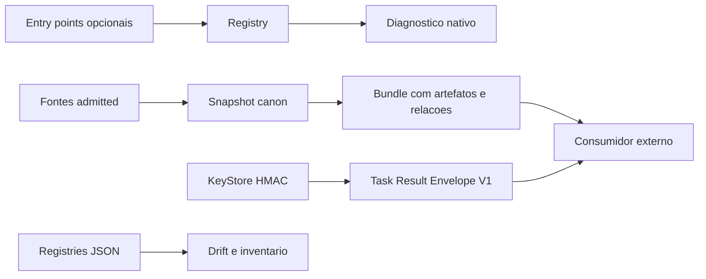
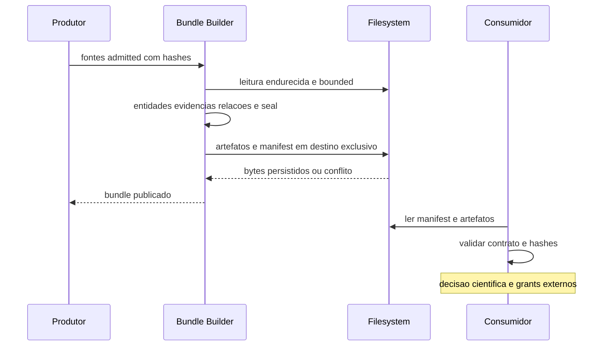
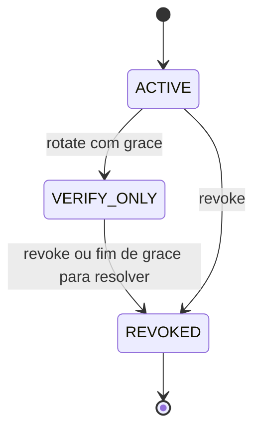
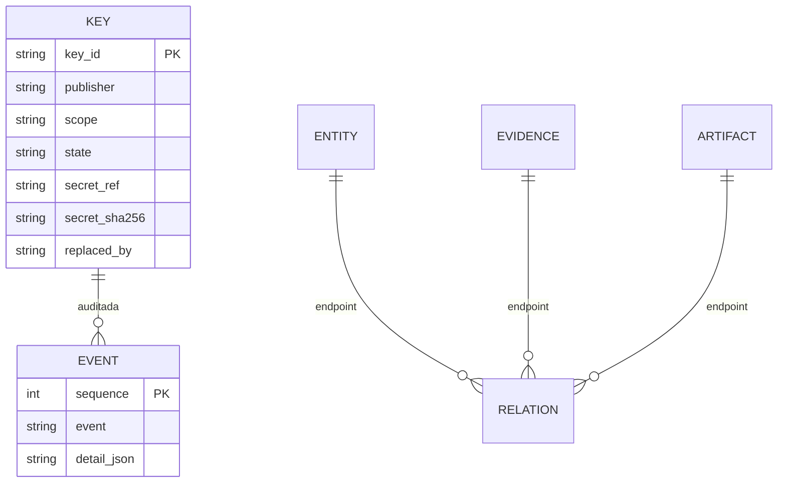

# Como funciona: ecosystem-predictor

Fonte primária: `C:\CAIN\contrato`, HEAD `a879525c49f1b3ac2050a3a70b10a322501b1e56`, branch `main`, versão declarada `0.2.0`. `origin/main` local e remoto ficam separados em baseline.json. Este texto descreve essa fonte, não substitui estudo da raiz de qualificação ou do servidor.

Registro opcional de plugins e diagnóstico nativo, inventário/compatibilidade declarativos e três contratos de pesquisa publicados separadamente: snapshot,bundle,protocol. Não é por si um transportador de jobs ou uma promoção econômica.

OD=observação direta; DD=declaração; ET-SRC=teste existente; ET-RUN=teste desta investigação; NV=não verificado. Todas as referências abaixo remetem ao hash em evidencias/ecosystem-predictor/hashes.json e ao registro append-only.

Caracterização preliminar salva antes da narrativa do repositório; o Anexo A foi exposto na leitura inicial do pedido, limitação de independência explicitamente registrada em PRELIMINAR_ecosystem-predictor.md. Nenhuma memória prévia foi usada.
## A. Propósito

API opt-in de plugins e contratos de evidência/pesquisa, preservando nomes e estados dos domínios. diagnóstico declara capitalFalse; estrutura de bundle/protocol não comprova verdade da hipótese nem execução real do consumidor.

## B. Estrutura

Root ecosystem0.2.0 mais research-snapshot1.0.2rc1,bundle1.0.1rc1,protocol1.0.3rc1: quatro pyprojects neste checkout. Root sem scripts CLI; scripts de inventário/drift/install/integration e wrapper PowerShell; pacotes de contrato independentes.

## C. Ambiente

RootPython>=3.13,<3.15 Pydantic; subpacotes>=3.11 e stdlib exceto bundle depende snapshot exato. Rootuv.lock parseado. Versão runtime literal ecosystem.__version__0.1.0 difere manifest0.2.0. Raízes e artefatos alternativos separados.

## D. Interfaces

Registry descobre entrypoints sob demanda e chama health/capabilities. Snapshot/bundle APIs validam/leem/exportam/publicam; protocolo valida/assina/verifica payload; HmacKeyStore cria vault/banco quando instanciado. install_candidate instala consumidores remotos e não foi executado.

## E. Configuração

registry JSON centraliza nomes,commits,wheelURLs/hashes,candidate/harness. Builder exige admitted_sources e expected hashes; limites/tamanhos/vocab e profiles são código. Resolver keys define confiança de publisher/key/scope fora de verify_task. Wrapper externo usa Python3.14 e log de C:/CAIN.

## F. Dados e persistência

Snapshot JSON canonical origin4partes,records/evidence offsets/hash; bundle JSON manifest/artifact files/referential integrity; protocolo task/result/envelope HMAC. Keystore SQLite keys/events e vault hashfilename32bytes,active key unique porpub/scope,backupmanifest. Não há abertura de banco original.

## G. Algoritmos e decisões

Regra sem ML: canonNFC/keys estritas/limites/hash/hardlink,net=gross-costs,estados incompatíveis comfalha/capital,isolamento nativo no diagnóstico,HMACcompare_digest. verify_task não avalia relógio atual: validade operacional da expiração pertence ao chamador.

## H. Fluxos completos

Plugin entrypoint→dedupe/load→health/caps→diagnostic envelope. Fonte admitted→hardened read→evidence/entity/relation→seal→publishbundle. Task canonical→signature→resolver→verifyshape; execução/modelagem é externa. Keystore provision→rotate→graceverify→revoke→backuprestore.

## I. Testes

Testes src cobrem doubles de plugins,contratos/hashes/paths/races,exportação,assinatura/tamper/revocation/backup e registros pinned. Seis smokes anteriores em3.12/3.13 são separados:3.13 contract3PASS. Actualdrift offline1 comdois attestations crypto expirados em27Sep; pytest completo não executado.

## J. Operação

CI declara bundle311-314,root313/314experimental,coverage75,securityhistory,gitleaks,SBoM,drift,integrationinstalled and pinnedsourcecrypto/cain. Cain-crypto-integration workflow constrói duas vezes,coteja hashes e roda wheels fora dafonte; receipt só criado após comandos, resultado histórico remoto é bloco próprio.

## K. Documentação e pendências

README/CURRENT_STATE dizem sete repositórios/dez packages; código e test_architecture_inventory contam onze com protocol quarto pyproject. ArchitectureImplementation nove é histórico. Registry ALIGNED com attestations vencidas é divergência atual offline. AnexoV2/fivepackages descreve outra época, não esta fonte.

## L. Fonte e artefato em uso

Root0.2.0 local; literalversion0.1.0. Fourpyprojects tracked; fullfilesearch delimita ausência local transport/compat. Cópia independente;3.13smoke contratos,sem rootinstalledplugins ou E2E. Registrocompatibilidade é candidato estático, não instalação atual nem último servidor.

## Componentes centrais

|Componente|Fonte e símbolo|Comportamento e limite|
|---|---|---|
|registro|`src/ecosystem/registry/__init__.py`::Registry (SHA256 `1e70a36b9e9e29c2a7be0a06cedf6e46fa054f163546d66fa291d4a438b2bb3e`; leitura em REGISTRO.log)|Descobre entry points predictor.plugins; duplicatas antes de load; diagnóstico separado por domínio e fail-closed.|
|contrato plugin|`src/ecosystem/contracts/v1.py`::PluginV1 (SHA256 `3d5c9a063d1e30456af8f9440160e5861835e4c7b127c8382a8962dfb2486f57`; leitura em REGISTRO.log)|Protocol health/capabilities e tipos request/response; não implementa handler de inferência.|
|diagnóstico|`src/ecosystem/contracts/diagnostics.py`::NativeCapabilities (SHA256 `1ab8f38f669c02839d4c8791c66bc4782e45f29d7b2e439565ea589c30bcaeee`; leitura em REGISTRO.log)|Estados nativos separados; capital_authorized_by_diagnostic=False; não converte nativo em enum legado.|
|snapshot|`packages/research-snapshot/src/research_snapshot/publication.py`::publish (SHA256 `751041b91735fce82b91bdedd9a1ed6bee19b1bc58d7e27fcdf5079f4054f2e6`; leitura em REGISTRO.log)|JSON canon/seal, identidade origin4partes,evidence hash/offset; hardlink sem sobrescrever e idempotência por bytes.|
|bundle|`packages/research-bundle/src/research_bundle/__init__.py`::validate (SHA256 `eadc9bffface70cfe79ba1cd2a0b50a18358f5d1d6dd3d9224bb732df85a2d36`; leitura em REGISTRO.log)|Manifest com entidades,evidências,relações,artefatos; limites,hashes e referência local consistente.|
|filesystem|`packages/research-bundle/src/research_bundle/files.py`::safe_open (SHA256 `e428434ccfcdaa62011b9693cdcd3a50dab9ce4cfa03328de58264a495363585`; leitura em REGISTRO.log)|Leitura descriptor/handle sem symlinks/reparse; tamanho/hash/stat; escrita/durabilidade conforme SO.|
|exportador|`packages/research-bundle/src/research_bundle/export.py`::Builder (SHA256 `834c7894dd995330cc8fb46ca594b72aeae449d613ba2a43a40151bcafdce0c5`; leitura em REGISTRO.log)|Admissão explícita de fontes,tamanhoUTF8/secret heuristics,trackedcommit,exporterfingerprint e publication fora da raiz produtora.|
|protocolo|`packages/research-protocol/src/research_protocol/__init__.py`::verify_task (SHA256 `574d4cd0f62d3d22d00877ad68b4cee61364730ae1238a3c53e921dabc3b01ad`; leitura em REGISTRO.log)|Task/Result/EnvelopeV1 NFC sem floats,HMAC; cálculo de net/cutoff/estados restritos e resolver externo de chave.|
|chaves|`packages/research-protocol/src/research_protocol/key_store.py`::HmacKeyStore (SHA256 `22f9c3a8ad9ed9ed5bffeff5b3477b95b90065ab92c46d23ddafdf3bdfb3d093`; leitura em REGISTRO.log)|SQLite metadata/vault separado,ACL,rotação,VERIFY_ONLY grace,revoke,backup/restore; não aberto nos originais.|
|inventário/drift|`scripts/check_ecosystem_drift.py`::check_offline (SHA256 `cd1862ed39efd805c97df60837ad0c5a7b0ee45ddbd3a5246ee81477f1941e4f`; leitura em REGISTRO.log)|Confronta registros,hashes declarados e validade temporal de attestations; não prova ciência.|
|integração real|`scripts/check_real_plugin_integration.py`::main (SHA256 `3e63ad883adb97147cad4c8c711fce27c1bf9a567654ea5fae478ad753623105`; leitura em REGISTRO.log)|Valida fontes/wheel precisas e plugins instalados e produz receipt de ambiente; não executado.|
|saúde externa|`ecosystem_health.ps1`::wrapper (SHA256 `6e789a4808118c18f990ee591a75da213de9b634546335584765b1b8c3a9ddd3`; leitura em REGISTRO.log)|Chama script fora da raiz e append log C:/CAIN; comentário read-only não garante leitura pura.|

## Achados rastreáveis

**ECO-01 [OD] — Manifest e versão runtime divergem.** Literal0.1.0 frente pyproject0.2.0; não é verificação de wheel remota. Fonte: `src/ecosystem/__init__.py`::__version__ (SHA256 `ae46dfb390b1863c9f737b1fa6e1556d855069c45f806ed4d5405bacdbfaeeeb`; leitura em REGISTRO.log); artefato `evidencias/ecosystem-predictor/baseline.json`.

**ECO-02 [OD/DD] — Onze pacotes no inventário atual contra dez na narrativa.** Sete raízes registry mais protocol quarto pyproject total11; docs dez e histórico nove têm épocas diferentes. Fonte: `tests/test_architecture_inventory.py`::test (SHA256 `51ba4b3f7be8cc59fad6752efb99d7f826ff21f46598eebc47c0701d5d0f8721`; leitura em REGISTRO.log); artefato `evidencias/ecosystem-predictor/source-catalog.json`.

**ECO-03 [ET-RUN/OD] — Dois atestados crypto vencidos seguem ALIGNED.** Comando real offline na cópia3.13 exit1 em30Sep; validade até27Sep. Não é execução científica nova. Fonte: `scripts/check_ecosystem_drift.py`::check_offline (SHA256 `cd1862ed39efd805c97df60837ad0c5a7b0ee45ddbd3a5246ee81477f1941e4f`; leitura em REGISTRO.log); artefato `evidencias/ecosystem-predictor/drift-offline-run.txt`.

**ECO-04 [OD] — Wrapper de saúde não é somente leitura.** Chama C:/CAIN/tools/ecosystem_health.py e acrescenta log externo. Não executado. Fonte: `ecosystem_health.ps1`::external invocation (SHA256 `6e789a4808118c18f990ee591a75da213de9b634546335584765b1b8c3a9ddd3`; leitura em REGISTRO.log); artefato `evidencias/ecosystem-predictor/source-catalog.json`.

**ECO-05 [OD] — Verificação protocol é estrutural e criptográfica.** Não executa tarefa nem consulta relógio para expiração; confiança scope depende resolver de caller. Fonte: `packages/research-protocol/src/research_protocol/__init__.py`::verify_task (SHA256 `574d4cd0f62d3d22d00877ad68b4cee61364730ae1238a3c53e921dabc3b01ad`; leitura em REGISTRO.log); artefato `evidencias/ecosystem-predictor/contract-smoke-run-313.txt`.

**ECO-06 [OD/NV] — Contrato transport/compat não encontrado nesta raiz.** Busca arquivo integral tracked/untracked exclui.git/.venv/caches; não generaliza servidor/raiz alternativa. Fonte: `packages`::inventory (SHA256 `consultar hashes.json para caminho efetivo`; leitura em REGISTRO.log); artefato `evidencias/ecosystem-predictor/all-files.txt`.

## Integrações

|Origem → destino|Mecanismo e fonte|Payload, confiança e erro|Estado|
|---|---|---|---|
|Registry → plugins instalados|importlib.metadata entry_points; `src/ecosystem/registry/__init__.py` (SHA256 `1e70a36b9e9e29c2a7be0a06cedf6e46fa054f163546d66fa291d4a438b2bb3e`; leitura em REGISTRO.log)|health/capabilities native; código plugin executa com permissões processo; sem autenticação rede; load errors isolados;dup fail before load|OD/ET-SRC;instalação atual NV|
|producer → consumer research|snapshot/bundle JSON filesystem; `packages/research-bundle/src/research_bundle/export.py` (SHA256 `834c7894dd995330cc8fb46ca594b72aeae449d613ba2a43a40151bcafdce0c5`; leitura em REGISTRO.log)|origin,evidence,entities,artifact hashes,relations; admittedsources/hash;restrictionflags declarativos; boundedread/validation/atomicpublication/conflict|OD/ET-SRC;smoke contrato ET-RUN|
|CAIN/crypto callers → research-protocol|Task/Result/EnvelopeV1 HMAC; `packages/research-protocol/src/research_protocol/__init__.py` (SHA256 `574d4cd0f62d3d22d00877ad68b4cee61364730ae1238a3c53e921dabc3b01ad`; leitura em REGISTRO.log)|payloadSHA,messageID,provenance,states,economics; HMAC>=32bytes e keyresolver escopado pelo caller; strictshape,tamper reject;expiração atual externa|OD/ET-SRC;contrato ET-RUN;E2E NV|
|HmacKeyStore → vault e SQLite|filesystem e transações; `packages/research-protocol/src/research_protocol/key_store.py` (SHA256 `22f9c3a8ad9ed9ed5bffeff5b3477b95b90065ab92c46d23ddafdf3bdfb3d093`; leitura em REGISTRO.log)|keys/events/hashreceipts/backups; ACLcurrentSID+SYSTEM ouPOSIX700/600; rotategrace/revoke/compensação/restore|OD/ET-SRC;vault original não aberto|
|scripts registry → GitHub/checkouts externos|git/API/pip workflows; `scripts/check_architecture_manifest.py` (SHA256 `44bd5bc3d2fc5d0e7905a898a20a2fb7c9c025e3786996c6250e943ce1d55964`; leitura em REGISTRO.log)|manifest/commit/wheelversion/hash/receipt; GITHUB_TOKEN opcional só nome; unverifiable2/drift1/declaredwarning|OD;rootconsolidado remoto|
|ecosystem_health.ps1 → CAIN/tools + log|PowerShell python subprocess; `ecosystem_health.ps1` (SHA256 `6e789a4808118c18f990ee591a75da213de9b634546335584765b1b8c3a9ddd3`; leitura em REGISTRO.log)|health/status e appendlog; permissõesSO; exitcode externo|OD;não executado|

## Diagramas

## Cobertura, limites e continuidade

Código próprio executável, testes, CI, schemas, manifests e lock selecionados constam em source-catalog.json e coverage.json por módulo. Testes foram lidos, mas a suíte completa não foi executada. Documentação narrativa/histórica é amostrada: README, ARCHITECTURE_IMPLEMENTATION, HANDOFF e documentos materialmente relacionados a conflitos; inventário Git delimita os demais. Caches, terceiros, builds e ambientes não foram qualificados como código próprio. Nenhum treinamento, backtest amplo, API paga, instalação pesada, agendamento ou capital foi acionado.

Próximo bloco: confrontar raízes alternativas separadas, finalizar cadeia de assets/README da wheel e CI remota no estudo consolidado. Nenhum ET-RUN limitado deve ser generalizado para estado científico, lucro, autorização de capital ou funcionamento de instalação real.
