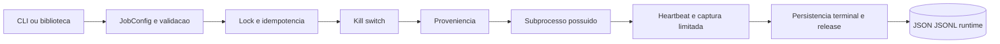
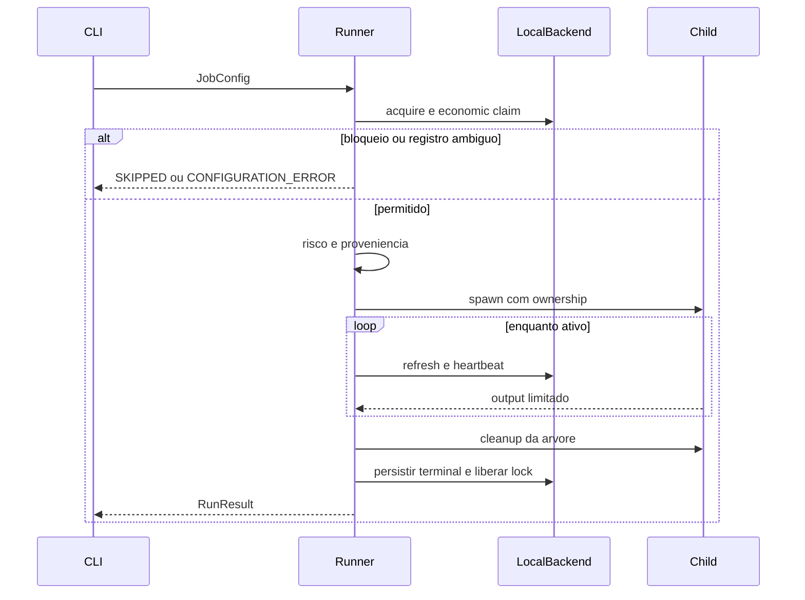
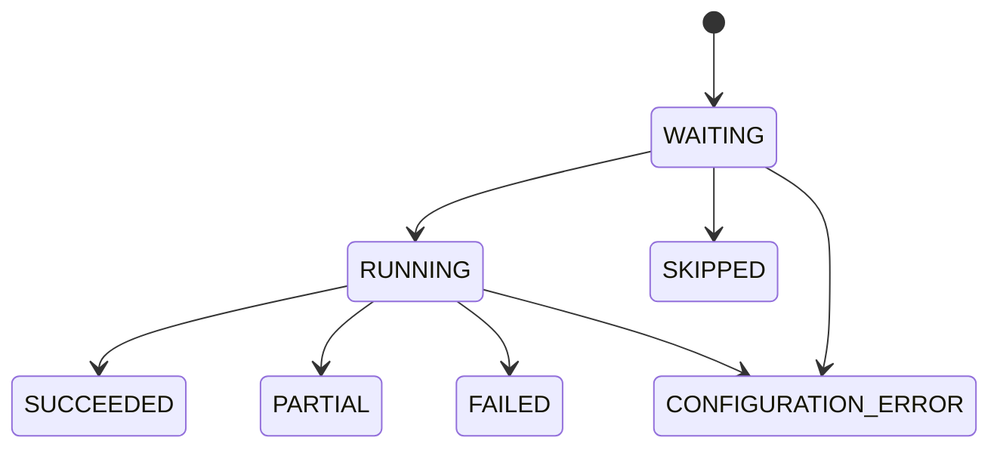

# Como funciona: predictor-ops

Fonte primária: `C:\PREDICTORS\predictor-ops`, HEAD `b19e69527c0fda5cb1f96281d3a984fea1431768`, branch `main`, versão declarada `4.2.1`. `origin/main` local e remoto ficam separados em baseline.json. Este texto descreve essa fonte, não substitui estudo da raiz de qualificação ou do servidor.

Supervisor local de subprocessos, locks, heartbeat, proveniência e restrições operacionais. Estados científicos são transportados como metadados; o runner não calcula edge.

OD=observação direta; DD=declaração; ET-SRC=teste existente; ET-RUN=teste desta investigação; NV=não verificado. Todas as referências abaixo remetem ao hash em evidencias/predictor-ops/hashes.json e ao registro append-only.

Caracterização preliminar salva antes da narrativa do repositório; o Anexo A foi exposto na leitura inicial do pedido, limitação de independência explicitamente registrada em PRELIMINAR_predictor-ops.md. Nenhuma memória prévia foi usada.
## A. Propósito

Supervisor operacional genérico e reutilizável; resultado SUCCEEDED é sucesso de subprocesso, não GO científico. Permissão de capital é dado explícito do config, não autorização autenticada em uma corretora.

## B. Estrutura

Pacote src/predictor_ops, CLI predictor-ops e __main__, scripts validate_installed/published/consumers, testes_v2 e integração POSIX/Windows. Dockerfile declara ambiente de container; testes de Windows criam tarefas e por isso não foram executados.

## C. Ambiente

Python>=3.13; pydantic e pydantic-settings declarados. uv.lock parseado integralmente em dependency-identities.json. Runtime disponível3.12 tem Pydantic mas não pytest;3.13 não tem Pydantic. Smoke3.12 é exploratório fora do suporte, sem instalação de dependências.

## D. Interfaces

CLI validate lê JSON; provenance verifica identidade; run configura e aciona subprocesso. FileJobConfigSource e HttpJobConfigSource implementados. Runner escreve heartbeat/run/events, captura streams e encerra árvore em timeout, shutdown ou perda da trava.

## E. Configuração

JobConfig: argv/cwd/env,timeout3600,heartbeat30,output10MB,expected_artifacts,provenance_mode,job_type/economic_key. Runtime local default home/.local/state/predictor-ops,TTL86400. Configuração de capital exige todos limites e snapshot atual confiável explícito.

## F. Dados e persistência

runtime por job: lock,heartbeat.json,runs/<run_id>.json,events.jsonl e economic record. Chave econômica inclui cinco dimensões/UTC com separador reservado e SHA256. Claim IN_PROGRESS anterior ao child; ambiguidade em execução de capital é preservada para reconciliação. Expected_artifacts apenas verifica existência.

## G. Algoritmos e decisões

Regras de kill switch bloqueiam dado ausente, velho/futuro, fonte não confiável, saúde falsa ou limiar atingido. retry_action retorna recomendação por estado de ordem; runner não faz reexecução automática. Exit0SUCCEEDED,2PARTIAL e restantes FAILED são mapeamentos operacionais.

## H. Fluxos completos

Validar config → adquirir lock → verificar idempotência/risco → coletar proveniência → registrar início → spawn possuído → heartbeat/captura limitada → terminar/limpar → persistir terminal/release. Falhas pré-spawn3,reader74,lockloss75,timeout124 e shutdown130 têm caminhos próprios.

## I. Testes

Testes existentes cobrem travas multiprocessos, árvore real, memory bound, redaction adversarial, wheel adulterada e scheduler Windows. ET-SRC não é execução. Três smokes stdlib do runtime/advisory em3.12 passaram; runner com deps/CLI/wheel/Windows não foi validado nesta investigação.

## J. Operação

CI declara Linux/Windows3.13 e Linux3.14,lint,typing,coverage80,security,pip-audit,build/wheel fora da fonte e container. Docker Python3.14Alpine digest/nonroot. Módulo windows consulta tarefas existentes; suite windows_integration cria/remove tarefa temporária se executada.

## K. Documentação e pendências

README4.2.1 concorda com supervisor e declara histórico de implantação com agendamentos desativados. Não tratamos esse relato como daemon atual. Anexo cita4.2.2rc2; fonte local4.2.1 e raiz qualificação4.2.2rc1 são épocas distintas.

## L. Fonte e artefato em uso

Checkout4.2.1 e cópia independente identificados. Nenhuma instalação atual4.2.1,container ativo,serviço/agendamento ou execução econômica foi confirmado. Verificação remota e alternativa4.2.2rc1 em blocos separados.

## Componentes centrais

|Componente|Fonte e símbolo|Comportamento e limite|
|---|---|---|
|CLI|`src/predictor_ops/cli.py`::main (SHA256 `b606006c1ad264d1a14ec94941887a462859a8d32f390db2421911aab625b7da`; leitura em REGISTRO.log)|validate, provenance e run; JSON de erro sanitizado e sinais de shutdown.|
|configuração|`src/predictor_ops/config.py`::HttpJobConfigSource (SHA256 `8b1ff67f8f477221836390bd99fc8f2e42824ad225b8fa6f23982916b4b758d9`; leitura em REGISTRO.log)|JSON local ou HTTPS por interface de biblioteca; CLI seleciona arquivo.|
|modelos|`src/predictor_ops/models.py`::JobConfig (SHA256 `f9d3c0c318111df8b80ca0a16508962f2eb0ad55b5c28725bae2f3d0b162141b`; leitura em REGISTRO.log)|Pydantic; schemas jobs1/2/3, chave econômica e limites/snapshot.|
|runner|`src/predictor_ops/runner.py`::run_job (SHA256 `6dfeed54229ef41368e19fe30833e54b33197b2184b6aed280b43093bc48325f`; leitura em REGISTRO.log)|Trava, idempotência econômica, risco, subprocesso, captura limitada, heartbeat e persistência final.|
|processos|`src/predictor_ops/processes.py`::WindowsJob (SHA256 `4264004e4eca665d6df491ab6038453725ca3f042de0fe58f739cc6c0d59f00f`; leitura em REGISTRO.log)|Windows JobObject/suspensão inicial; POSIX grupo de processos; limpeza/timeout.|
|runtime|`src/predictor_ops/runtime.py`::LocalBackend (SHA256 `16a58ca233c7aac997cf981823bf26898814b85f782abf4c6c705da7e78441fa`; leitura em REGISTRO.log)|O_EXCL com guard de SO e posse run_id; JSON atômico/fsync e JSONL com trava.|
|proveniência|`src/predictor_ops/provenance.py`::collect_provenance (SHA256 `168d0e07ea946eb5a6cc132f0051e9b3e1d42a68adccd5fc7fdc3ea35f5feca3`; leitura em REGISTRO.log)|Git limpo ou wheel RECORD sha256; strict rejeita identidade não verificada.|
|redação|`src/predictor_ops/redaction.py`::redact_text (SHA256 `a81ea44822af1d2a4182333b704370a2a74505994b854cfb3b32a4583eaa0ba0`; leitura em REGISTRO.log)|Sanitização de chaves/flags/headers/valores; colhe valores sensíveis longos.|
|risco|`src/predictor_ops/operations.py`::retry_action (SHA256 `792299a91987c8614717291dfcaf63a445226efda3a99edccf03a70a10a5458d`; leitura em REGISTRO.log)|Kill switch fail-closed e conselho de retry/reconciliação; não automatiza ordens.|
|health Windows|`src/predictor_ops/windows.py`::inspect_scheduled_task (SHA256 `857dbf2bb6f60ba700aa87d91ffebdeb2f49e58ddcb13eab7a57c621aeaf9e7f`; leitura em REGISTRO.log)|Consulta PowerShell do agendador; não registra tarefas.|
|health|`src/predictor_ops/health.py`::assess (SHA256 `aad569e06ee1a4467e65ccc42403ffaf08656e53ff346bda6302a97ec9b1990b`; leitura em REGISTRO.log)|Combina heartbeat terminal/frescura e status agendador opcional.|
|observabilidade|`src/predictor_ops/observability.py`::configure_otel (SHA256 `eea032441420d3583d291f90ad7d7a8fc6f649d983267636fce45d200febce44`; leitura em REGISTRO.log)|JSON logging; OTEL opcional configurado por chamador.|

## Achados rastreáveis

**OPS-01 [OD] — Artefato esperado é existência apenas.** Caminho existente pode ser antigo; este gate não valida hash, conteúdo ou origem do artefato. Fonte: `src/predictor_ops/runner.py`::run_job (SHA256 `6dfeed54229ef41368e19fe30833e54b33197b2184b6aed280b43093bc48325f`; leitura em REGISTRO.log); artefato `evidencias/predictor-ops/source-catalog.json`.

**OPS-02 [OD] — Chave econômica impede reexecutar ambiguidade.** Capitalpermission conserva registro prévio e requires_reconciliation. Não executa reconciliação externa automaticamente. Fonte: `src/predictor_ops/runner.py`::run_job (SHA256 `6dfeed54229ef41368e19fe30833e54b33197b2184b6aed280b43093bc48325f`; leitura em REGISTRO.log); artefato `evidencias/predictor-ops/source-catalog.json`.

**OPS-03 [OD/ET-SRC] — Travas e ownership de processos têm mecanismos reais.** Guard de SO/O_EXCL/runid e JobObject/grupo POSIX; testes adversariais existem, não foram executados nesta rodada. Fonte: `src/predictor_ops/runtime.py`::LocalBackend (SHA256 `16a58ca233c7aac997cf981823bf26898814b85f782abf4c6c705da7e78441fa`; leitura em REGISTRO.log); artefato `evidencias/predictor-ops/test-assertions.json`.

**OPS-04 [ET-RUN/NV] — Smoke está fora do runtime declarado.** 3 testes passaram em3.12;>=3.13 exige dependências não disponíveis e não foi substituído por falsa equivalência. Fonte: `pyproject.toml`::requires-python (SHA256 `825e1f5ccb9b94d94fdcd76de2132fb483d0aad77618eaf9ba9988edefcefb57`; leitura em REGISTRO.log); artefato `evidencias/predictor-ops/smoke-run.txt`.

**OPS-05 [OD] — Permissão de capital vem do config.** Kill switch valida declarações locais; autorização de pessoa/corretora e fonte de risco real não comprovadas. Fonte: `src/predictor_ops/models.py`::JobConfig (SHA256 `f9d3c0c318111df8b80ca0a16508962f2eb0ad55b5c28725bae2f3d0b162141b`; leitura em REGISTRO.log); artefato `evidencias/predictor-ops/source-catalog.json`.

## Integrações

|Origem → destino|Mecanismo e fonte|Payload, confiança e erro|Estado|
|---|---|---|---|
|CLI/chamador → subprocesso arbitrário|Popen sincronizado; `src/predictor_ops/runner.py` (SHA256 `6dfeed54229ef41368e19fe30833e54b33197b2184b6aed280b43093bc48325f`; leitura em REGISTRO.log)|argv/env/output/exit/state; permissão SO herdada; config de capital+risco; timeout/shutdown/perda lock encerra árvore|OD/ET-SRC; child atual NV|
|runner → filesystem runtime|local lock/JSON/JSONL; `src/predictor_ops/runtime.py` (SHA256 `16a58ca233c7aac997cf981823bf26898814b85f782abf4c6c705da7e78441fa`; leitura em REGISTRO.log)|runid/heartbeat/economickey/provenance; permissões SO; run_id de posse; atomic replace/fsync,ambiguidade preservada|OD/ET-SRC; auxiliares ET-RUN3.12|
|health Windows → Task Scheduler|PowerShell consulta; `src/predictor_ops/windows.py` (SHA256 `857dbf2bb6f60ba700aa87d91ffebdeb2f49e58ddcb13eab7a57c621aeaf9e7f`; leitura em REGISTRO.log)|status/action/last_result; permissão SO; sem credenciais persistidas; fail-closed missing/denied/schema|OD/ET-SRC; scheduler atual NV|
|HttpJobConfigSource → servidor HTTPS|urlopen; `src/predictor_ops/config.py` (SHA256 `8b1ff67f8f477221836390bd99fc8f2e42824ad225b8fa6f23982916b4b758d9`; leitura em REGISTRO.log)|JobsFile JSON1/2/3; headers injetados;HTTPS obrigatório; timeout/validação Pydantic|OD; serviço NV|
|observabilidade → OTEL exporter|SDK opcional; `src/predictor_ops/observability.py` (SHA256 `eea032441420d3583d291f90ad7d7a8fc6f649d983267636fce45d200febce44`; leitura em REGISTRO.log)|spans/logs; endpoint por argumento; dep opcional|OD; uso no runner não encontrado no escopo src integral|

## Diagramas

## Cobertura, limites e continuidade

Código próprio executável, testes, CI, schemas, manifests e lock selecionados constam em source-catalog.json e coverage.json por módulo. Testes foram lidos, mas a suíte completa não foi executada. Documentação narrativa/histórica é amostrada: README, ARCHITECTURE_IMPLEMENTATION, HANDOFF e documentos materialmente relacionados a conflitos; inventário Git delimita os demais. Caches, terceiros, builds e ambientes não foram qualificados como código próprio. Nenhum treinamento, backtest amplo, API paga, instalação pesada, agendamento ou capital foi acionado.

Próximo bloco: confrontar raízes alternativas separadas, finalizar cadeia de assets/README da wheel e CI remota no estudo consolidado. Nenhum ET-RUN limitado deve ser generalizado para estado científico, lucro, autorização de capital ou funcionamento de instalação real.
