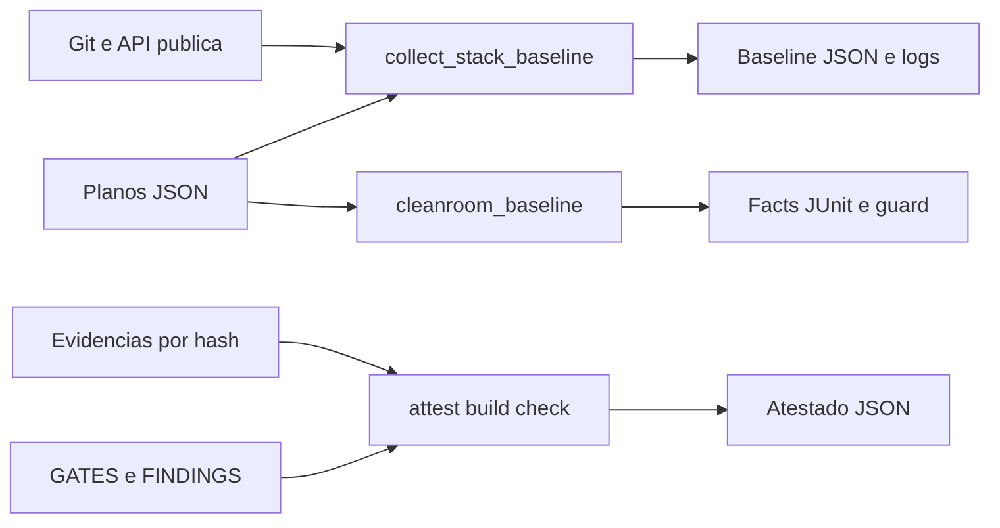
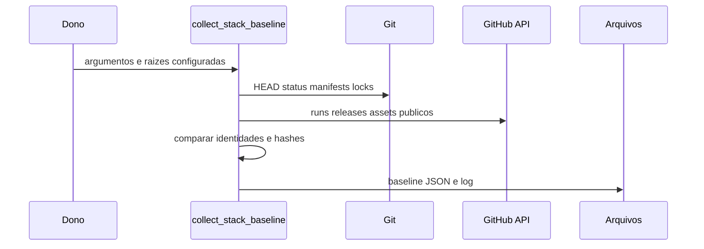
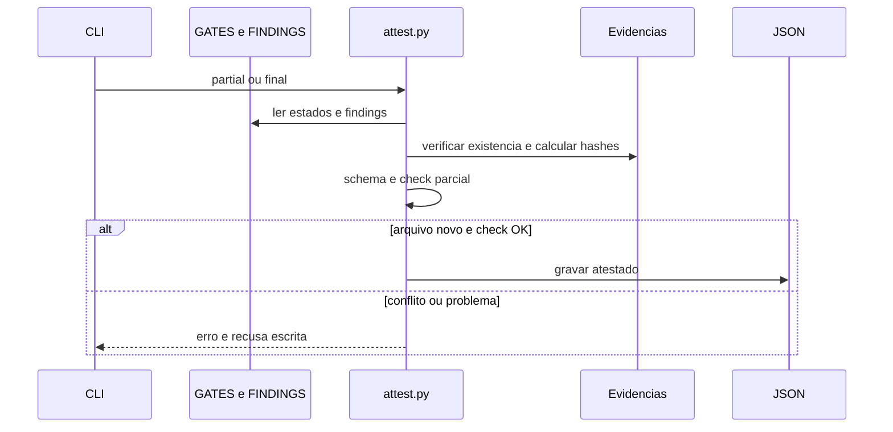
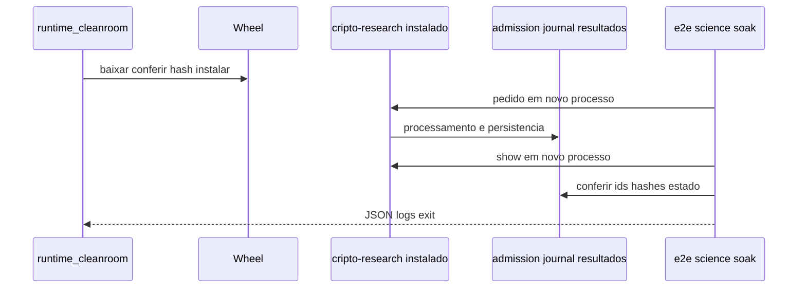
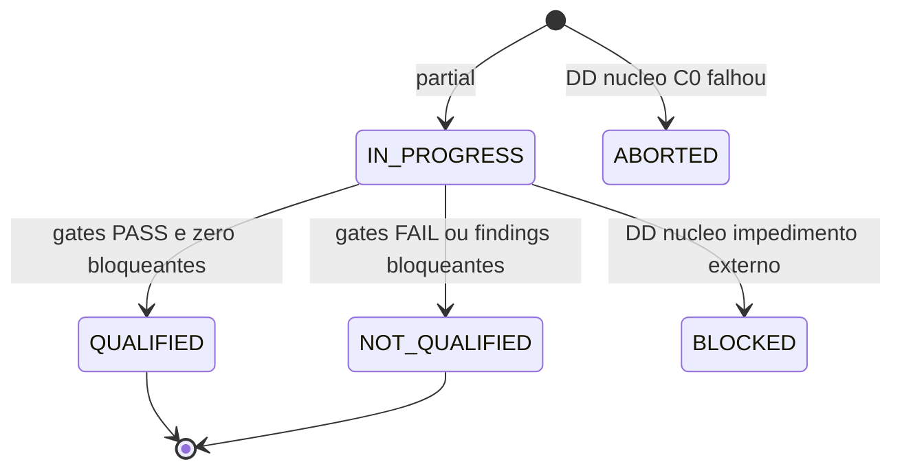
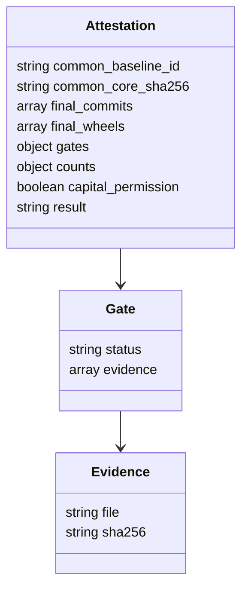

# Como funciona predictor-qualification

Fonte local e limites no INVENTARIO. Abaixo nós OD de scripts/esquemas; BLOCKED/ABORTED do diagrama de estados são DD do núcleo, explicitamente marcados. Nenhum diagrama é observação de serviço ativo.

## qual-componentes

## qual-sequencia-coleta

## qual-sequencia-atestado

## qual-sequencia-runtime

## qual-estados

## qual-schema

O contexto do repositório é evidência versionada. As sequências mostram coleta, construção de atestado e prova de runtime; cada execução pode gravar artefatos e por isso exige ambiente independente. O esquema representa objetos JSON, sem banco próprio demonstrado. QUALIFIED combina estados documentais e checks de identidade; não é previsão validada nem capital autorizado.
