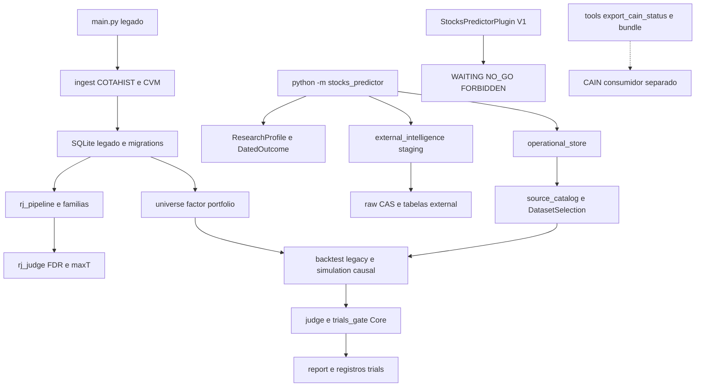
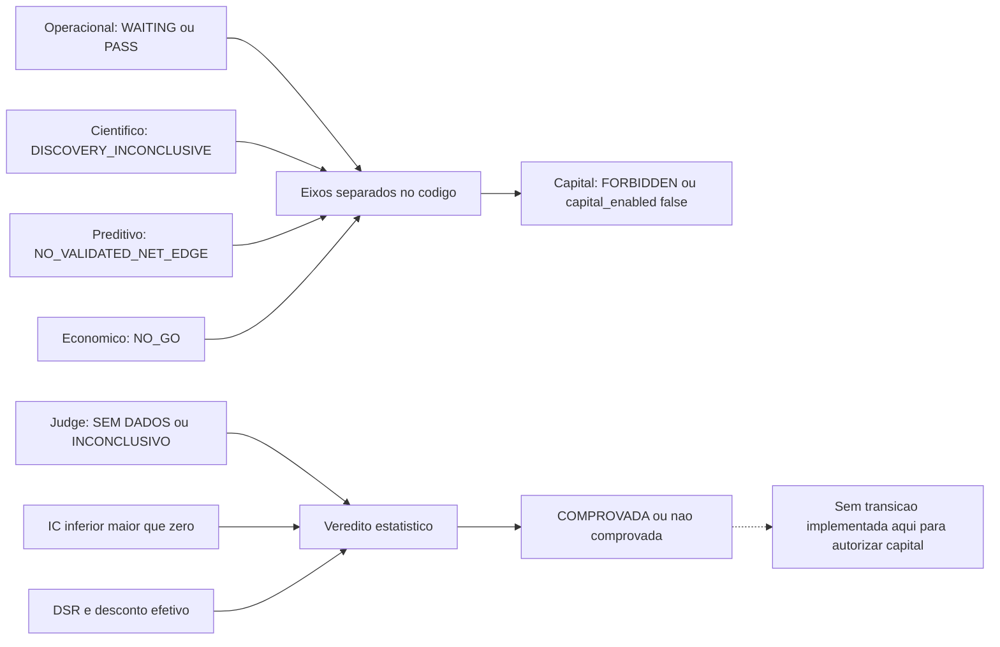
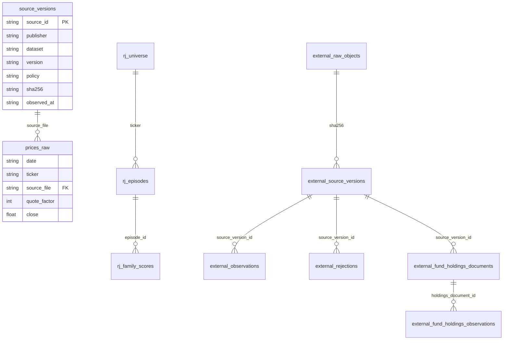

# Como funciona o Stocks Predictor observado

Esta documentação descreve o fonte local 0.2.0, independente de main remoto e do Anexo A. OD de código sustenta os elementos; a exportação tracejada para CAIN indica ligação entre processos por publicação de arquivo, sem chamada de serviço observada. Fonte/hashes, notas por módulo e teste seguro estão em `evidencias/stocks-predictor/`.

## Componentes



Há um runtime legado de pesquisa e um armazenamento operacional versionado separado. O legado guarda preços, eventos, fundamentos, runs e RJ. O armazenamento gerenciado preserva versões físicas de fonte e rejeita updates/deletes; o acesso legado recusa esse banco para evitar consultas que misturem versões. Staging externo tem contratos e proveniência próprios, sem alimentar automaticamente os fatores.

## Arquivo de dados até medição

```mermaid
sequenceDiagram
 participant U as Operador
 participant O as operations
 participant C as source_catalog
 participant D as operational_store SQLite
 participant S as DatasetSelection
 participant E as simulation
 U->>O: ingest arquivo ZIP, hash e versao explicita
 O->>D: BEGIN IMMEDIATE
 O->>C: copiar bytes temporarios e conferir SHA
 C->>C: parser estrito COTAHIST e filtro spot
 C->>D: source_versions e prices_raw atomicos
 D-->>O: receipt sem capital
 U->>S: source_ids cutoff e periodo
 S->>D: snapshot mode=ro
 D-->>S: fontes e precos escolhidos
 S->>S: normalizar FATCOT; recusar conflito
 U->>E: targets eventos corporativos e custos
 S->>E: barras e selection_sha
 E->>E: D+1, posicoes, custos e marcas
 E-->>U: medicao e hash de inputs; sem verdict economico
```

`source_catalog.ingest_version` copia bytes antes de parsear, verifica hash e identidade da versão, usa Savepoint e não aceita conteúdo distinto sob uma versão declarada. O parser estrito do catálogo interrompe linha malformada; parser legado tolera falhas individuais e conta rejeições. Cotações são normalizadas pelo FATCOT e filtradas para à vista quando configurado.

DatasetSelection escolhe source_ids e cutoff explicitamente. Seu observed_before é o conhecimento do catálogo, não prova de publicação no passado. A simulação recebe targets, custos e eventos corporativos explícitos; a referência desses eventos não certifica que estejam completos ou fossem conhecidos. O resultado é medição de engenharia, sem veredito econômico.

## Backtest e gates

Os fatores incluem momentum, volatilidade, proximidade da máxima, volume e contabilidade/valor. Universo usa calendário anterior à decisão e mediana de volume com zeros para sessões sem negócio. Deduplicação por quatro letras do ticker é heurística, não mapa histórico de emissores. Caminhos legacy conservam pressupostos das hipóteses julgadas; current accruals/E/P/B/M usam derivação PIT por versões.

`backtest.judge` calcula PSR e bootstrap pareado da diferença de Sharpe; séries vazias ou curtas têm estados próprios. `trials_gate.apply_dsr` acrescenta multiplicidade, desconto efetivo e falhas adicionais. Controle positivo plantado verifica sensibilidade do pipeline, sem demonstrar efeito em dados reais. Custos modelados, datas fornecidas e resultados históricos precisam de revisão independente antes de inferir lucro.

O gate de rebalanceamento econômico usa média menos z vezes erro padrão para comparar ganho com custo. Esse cálculo depende da maturidade/independência das observações; DatedOutcome verifica a cronologia informada, não sua veracidade. `capital_enabled` continua false.

## Recuperação judicial

```mermaid
sequenceDiagram
 participant U as CLI RJ
 participant D as SQLite legado
 participant P as rj_pipeline
 participant F as rj_families
 participant J as rj_judge
 U->>P: config asof e free_float opcional
 P->>D: universo e eventos approved_by
 D-->>P: precos e calendario
 P->>P: candidatos causais, primeiro episodio, outcomes e censura
 P->>F: features no trough
 F-->>P: valores ou None; ownership indisponivel no pipeline
 P->>J: uma unidade por empresa
 J->>J: bootstrap, permutacao e BH-FDR
 J-->>P: efeito CI p e influencia LOCO
 P->>P: bloquear secundarios com empresas repetidas
 P->>D: atualizar episodes scores e company_observations
 P-->>U: relatorio e faltas; sem capital
```

O pipeline escolhe primeiro candidato causal por empresa, classifica rally futuro e censura, e mantém exclusões visíveis. Inferência primária usa uma unidade por empresa, permutação com correção plus-one, bootstrap por cluster e BH-FDR. Volume contemporâneo é apenas descritivo. Ownership fica indisponível no pipeline; não virar zero silenciosamente. Episódios secundários com empresa repetida bloqueiam a inferência sem permutação por cluster.

LOCO mede influência do sinal, não validação preditiva. `joint_max_t` exige unidades/labels iguais entre famílias; o nome legado romano_wolf_stepdown é um alias dessa rotina. Haircut numérico e simulação de poder não constituem holdout real.

## Eixos de estado



A figura é um mapa de eixos e condições, não máquina de estados única: o código não define enum global com todas essas transições. PASS operacional, COMPROVADA estatística e lucro/permissão econômica são diferentes. A aresta tracejada expressa inferência limitada aos gates/plugin examinados: não foi encontrada ali transição para autorizar capital; não é prova de ausência em todo o acervo.

## Esquema



O ER é parcial e separa conceptualmente schemas de bancos distintos; tabelas de catálogo e staging não implicam banco único. Preços gerenciados têm UNIQUE(date,ticker,source_file), fontes têm identidade de publisher/dataset/version/policy e hash. Os timestamps available_at, observed_at, received_at e first_seen têm semânticas distintas. CDA e Entrega usam primeiro recebimento pelo coletor; entrega oficial e competência não provam disponibilidade pública histórica.

RJ atualiza episode e family_score sem chave de run; para reconstruir épocas distintas é necessário guardar snapshots/relatórios por execução. Snapshots operacionais usam backup SQLite consistente, SHA e INCOMPLETE até conclusão; restore cria destino novo.

## Operação segura e testes observados

Doctor/inspect gerenciados usam leitura mode=ro; `external status` e `external verify` via CLI inicializam conexão e gravam receipts quando sucesso. Esses nomes não autorizam execução em fontes forenses. Nenhuma coleta B3/CVM ou banco real foi executado no estudo.

Uma cópia independente foi usada para 11 checks stdlib de execução D+1, turnover, portfolio e gate econômico. Rerun Python3.13.14 passou; receipt anterior Python3.12.14 preservado. Isso não verifica suíte pytest, Core, integração persistência, previsões ou lucro.

## Ordem de leitura

pyproject.toml → operations.py → operational_store.py/source_catalog.py → dataset_selection.py → simulation.py; depois main.py → db.py → universe.py/factor.py → backtest.py/trials_gate.py. Para PIT: cvm_pit.py e source_history.py; para caixa: continuous_cash.py/retail_cash.py; para RJ: rj_pipeline.py → rj_episodes.py → rj_families.py → rj_judge.py. Staging externo fica em external_intelligence.py. Experimentos congelados e relatórios históricos ficam para segunda passagem, com cobertura final discriminada em coverage.json.

## Limites da revisão concluída

A revisão semântica dos executáveis próprios selecionados desta árvore foi concluída. Esse estado não certifica instalação, modelo vivo, dados de mercado ou lucro. Notas e hashes por arquivo delimitam exatamente a fonte examinada; fontes remotas e versões posteriores exigem sua própria revisão. Consulte o suplemento final de cobertura para testes executados e apenas lidos.


## Épocas remotas observadas

Os manifests do main remoto e os assets do Anexo foram verificados separadamente, por SHA/versão. Veja [confronto do Anexo](../CONFRONTO_ANEXO_REMOTO.md). Essas identidades não ampliam automaticamente a cobertura semântica da raiz primária nem provam integração runtime.
