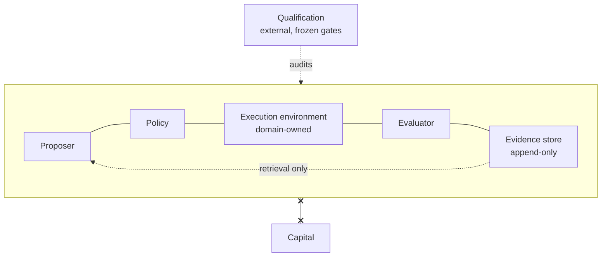

# Illustrative Architecture

> **Conceptual illustration. Does not describe the private implementation.** Roles are generic. No contract, schema, rule, state, order of execution or mechanism shown here corresponds literally to the private code.

## Roles and what each role is *not allowed* to do

| Role (generic) | What it does | What it can never do |
|---|---|---|
| Proposer | suggests what to investigate next; may use a model | decide, execute, touch evaluation data, grant resources |
| Policy | decides whether a proposal proceeds; deterministic and versioned | use a model, grant capital, change its own rules at run time |
| Execution environment | runs admitted work inside the domain that owns the data | be chosen by the proposer; promote a result's scientific or economic state |
| Evaluator | applies neutral scientific primitives to results | authorise anything |
| Evidence store | keeps results and their provenance, append-only | be rewritten; serve as a route to authority |
| Qualification | checks the whole loop from outside with frozen gates and raw logs | run inside the loop; grant capital |
| Capital | — | be reached by any role above |

The diagram shows **separations**, not a sequence. The real system's ordering, interfaces and intermediate components are deliberately omitted.

## Principles this picture is meant to convey

1. **The proposer never decides.** A model may suggest; a deterministic, versioned policy decides.
2. **The domain owns execution.** Handler, budget and resources are decided where the data and the responsibility live.
3. **States are never merged.** Operational success, scientific support and economic edge are three separate verdicts; none promotes another.
4. **Evidence is append-only and hash-identified.** Retrieval informs the next proposal but cannot rewrite the past.
5. **Capital is unreachable** by contract defaults, verified from outside by the qualification protocol.

## Future directions — proposed, not implemented

- A comparative experiment measuring whether the evidence→authority boundary changes agent behaviour under incentive.
- External timestamping of attestations.
- Independent human review of the qualification protocol.
